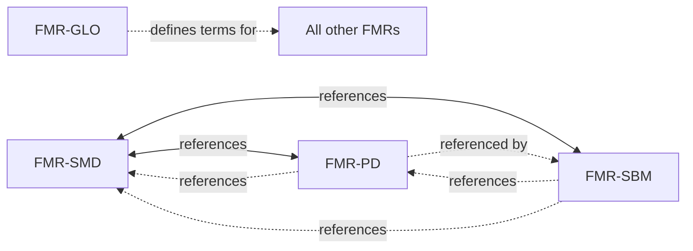

The End-to-End Process Flexibility Market Rule (FMR-E2E v2.0) defines a set of standard **Market Activities** organised across the six **Market Phases**. Each activity has defined data object inputs and outputs, an actor, time constraints, and dependencies on other activities.

The wider Flexibility Market Rules (FMRs) layer detailed obligations onto specific activities in their applicable sub-markets — for example, FMR-PQC sets the criteria used at Q.2 and Q.6 in DNO local sub-markets, and FMR-VSM governs how V.2 through S.2 are operated. This page covers both: the activity catalogue itself, and how the FMRs map onto it.

A note before starting: the End-to-End Process FMR explicitly recognises that **Market Activity can occur in parallel or sequentially to one another**. The dependency diagrams on this page show typical patterns, not strict sequences. Specific Sub-Markets vary in which activities they use and how they order them.

## Flexibility Market Rules — overview

The Market Facilitator owns and maintains a set of Flexibility Market Rules, organised into two collections — **Sub-Market Alignment** (rules that standardise how individual Sub-Markets operate) and **Market Coordination** (rules that handle interactions between Sub-Markets and System Operators).

| Identifier | Title | Collection | Applicability | Version |
| --- | --- | --- | --- | --- |
| **FMR-GLO** | Market Facilitator Glossary | Sub-Market Alignment | All FMRs and Governance Documents | 1 |
| **FMR-E2E** | End-to-End process for flexibility services | Sub-Market Alignment | All DNO and NESO Sub-Markets | 2 |
| **FMR-SMD** | Sub-Market definitions | Sub-Market Alignment | All Sub-markets | 2.1 |
| **FMR-PD** | Product definitions | Sub-Market Alignment | All DNO Sub-markets | 2.1 |
| **FMR-PQC** | Pre-Qualification Criteria | Sub-Market Alignment | All DNO sub-markets | 2 |
| **FMR-SBM** | Standard Baselining Methodologies | Sub-Market Alignment | All DNO sub-markets | 2.1 |
| **FMR-VSM** | Verification and Settlement | Sub-Market Alignment | All DNO sub-markets | 2.2 |
| **FMR-CRM** | Carbon Reporting Methodology | Sub-Market Alignment | All DNO sub-markets | 2 |
| **FMR-PR** | Primacy Rules | Market Coordination | NESO and DNOs supporting MW Dispatch Sub-Market | 2 |
| **FMR-RSR** | Revenue Stacking Requirements | Market Coordination | All System Operator sub-markets | 2 |

Three structural points worth noting:

- **FMR-GLO underpins everything.** It defines the terminology used across all FMRs and Governance Documents, and is referenced by every other FMR.
- **The Sub-Market Alignment collection is broad and DNO-flavoured.** Most rules apply to all DNO Sub-Markets; a few (FMR-E2E, FMR-SMD) cover NESO Sub-Markets too. NESO Sub-Markets are largely governed by NESO's own Service Terms and Procurement Rules, with FMR-E2E and FMR-SMD providing common framing.
- **The Market Coordination collection is narrow and targeted.** FMR-PR governs the specific case where MW Dispatch Sub-Market activity creates conflict between system operators. FMR-RSR sets common definitions for revenue stacking across all System Operator Sub-Markets.

### How the Flexibility Market Rules map onto Market Activities

Each FMR (other than FMR-GLO, which is cross-cutting) declares one or more activities it directly relates to. The mapping:

| Activity | Phase | FMR(s) that apply |
| --- | --- | --- |
| E.1 Define Sub-Market | Exploration | FMR-E2E, FMR-PD, FMR-SMD |
| E.2 Understand Flexibility Markets | Exploration | FMR-RSR |
| E.3 Build Investment Case | Exploration | — |
| E.4 Develop Operational Strategy | Exploration | — |
| Q.1 Register Service Provider | Qualification | — |
| Q.2 Qualify Commercially | Qualification | FMR-PQC |
| Q.3 Register Product | Qualification | — |
| Q.4 Sign General T&Cs | Qualification | — |
| Q.5 Register Assets | Qualification | — |
| Q.6 Pre-Qualify Assets | Qualification | FMR-PQC |
| Q.7 Register Units | Qualification | — |
| Q.8 Pre-Qualify Units | Qualification | — |
| Q.9 Pre-Qualify Grid | Qualification | — |
| Q.10 Test Units | Qualification | — |
| Q.11 Register Baseline Method | Qualification | FMR-SBM |
| Q.12 Sign Service Contract | Qualification | — |
| C.1 Communicate Buy Requirements | Competition | — |
| C.2 Communicate Sell Requirements | Competition | — |
| C.3 Clear Market | Competition | FMR-PR |
| D.1 Maintain Unit Availability | Scheduling and Dispatch | — |
| D.2 Provide Operational Visibility | Scheduling and Dispatch | — |
| D.3 Dispatch Units | Scheduling and Dispatch | FMR-PR |
| D.4 Dispatch Assets | Scheduling and Dispatch | — |
| D.5 Cease Units | Scheduling and Dispatch | — |
| D.6 Cease Assets | Scheduling and Dispatch | — |
| V.1 Collate Verification Data | Verification | — |
| V.2 Process Verification Data | Verification | FMR-VSM |
| V.3 Communicate Performance | Verification | FMR-VSM |
| V.4 Communicate Consequences of Non-Delivery | Verification | FMR-VSM |
| V.5 Manage Disputes | Verification | — |
| V.6 Report on Service Delivery | Verification | FMR-CRM |
| S.1 Generate Invoices | Settlement | FMR-VSM |
| S.2 Process Payments | Settlement | FMR-VSM |

A few patterns worth noticing:

- **FMR-VSM has the deepest footprint.** It applies to five consecutive activities (V.2–V.4 plus S.1–S.2), reflecting that verification, dispute consequences, invoicing, and payment are tightly coupled in practice and benefit from common rules.
- **FMR-PQC sits at two specific gates.** Q.2 (commercial qualification) and Q.6 (technical asset pre-qualification). These are the two pre-qualification points where standardised criteria reduce the per-Sub-Market burden on FSPs.
- **Many activities have no FMR mapped today.** Sixteen of the 33 activities have no FMR directly applicable. This isn't a gap so much as a deliberate scope — these activities are either operationally too varied across Sub-Markets to standardise yet, or are governed by NESO Service Terms / DNO Service Terms rather than by central FMRs.
- **Rule cross-references add a second layer.** FMR-PD references FMR-SMD; FMR-SBM references both FMR-SMD and FMR-PD; FMR-SMD is referenced by FMR-PD and FMR-SBM. The Sub-Market Alignment rules form a small interconnected cluster.

### Inter-rule references

Not every relationship between rules is captured by activity mapping — some rules reference each other directly. The pattern of references in v2.x of the FMRs:

The FMR-SMD ↔ FMR-PD ↔ FMR-SBM cluster reflects that Sub-Market design, Product specification, and baselining methodology are mutually defining — you can't fully specify one without referring to the others.

## New FMAR activity catalogue (TO-BE)

Yet to be reflected new End-to-End process building blocks identified by FMAR program to be included in the schema.

| Phase | Code | Activity |
| :-- | :-- | :-- |
| Qualification | FMAR.1 | Register as FMAR Party |
| Qualification | FMAR.2 | Grid Validation |
| Qualification | FMAR.3 | Transfer Asset |
|  |  |  |

### NEW SSES activity catalogue (TO-BE)

| Phase | Code | Activity |
| :-- | :-- | :-- |
| Qualification | SSES.1 | Register as Load Controller |
| Qualification | SSES.2 | Register Resource |
| Qualification | SSES.3 | Activate Resource |

## 

## The full activity catalogue

The 33 standard Market Activities, with their v2.0 definitions from the End-to-End Process FMR.

### Exploration

| Code | Activity | Definition |
| --- | --- | --- |
| **E.1** | Define Sub-Market | Identify and describe the scope, operator, and objectives of the Sub-Market. |
| **E.2** | Understand Flexibility Markets | Gather and analyse market design, rules, and price signals. |
| **E.3** | Build Investment Case | Assess costs, revenues, and risks to justify participation. |
| **E.4** | Develop Operational Strategy | Identify operational needs, formulate internal processes and readiness plans. |

### Qualification

| Code | Activity | Definition |
| --- | --- | --- |
| **Q.1** | Register Service Provider | Submit commercial information to become a recognised Service Provider for a product within a Sub-Market. This includes both user and company information as part of onboarding and wider commercial criteria, for example commercial qualification criteria in FMR-PQC. |
| **Q.2** | Qualify Commercially | Confirm Service Provider commercial criteria such as credit, corporate compliance and insurance details are in line with the obligations, for example commercial qualification validation criteria in FMR-PQC. |
| **Q.3** | Register Product | Publish product parameters, for example structured product definition parameters in FMR-PR or NESO Service Parameters, in a machine-readable format. |
| **Q.4** | Sign General T&Cs | Sign general terms forming part of an agreement which applies to the provision of flexibility services and establishes the common legal and commercial framework between the parties. |
| **Q.5** | Register Assets | Provide technical information about Asset required for participation in the Sub-Market in line with obligations, for example technical qualification parameters in FMR-PQC or NESO Eligible Asset requirements. |
| **Q.6** | Pre-Qualify Assets | Verify Asset technical requirements are in line with obligations, for example technical qualification validation criteria in FMR-PQC or NESO Service Parameters. |
| **Q.7** | Register Units | Provide additional technical information about Unit and/or allocation of Assets to a Unit, used for bidding a product. |
| **Q.8** | Pre-Qualify Units | Verify additional technical information about Units and their logical control and/or grid connectivity, required for delivery of a product, for example NESO Service Terms. |
| **Q.9** | Pre-Qualify Grid | Verify relevant network segment(s) can handle a Unit providing the product, meaning system readiness, typically involving some form of grid impact assessment. |
| **Q.10** | Test Units | Conduct operational trial on Unit, such as a communication test or dispatch test, to confirm readiness ahead of actual service delivery. |
| **Q.11** | Register Baseline Method | Submit baseline method, according to applicable baselining methodology, for using when assessing performance. |
| **Q.12** | Sign Service Contract | Sign terms forming part of an agreement which applies to a specific flexibility service and set out the detailed service requirements, operational arrangements and payment basis for that service. |

### Competition

| Code | Activity | Definition |
| --- | --- | --- |
| **C.1** | Communicate Buy Requirements | Publish buy order, or sub-market requirements, reflecting calculated operational need for flexibility services. |
| **C.2** | Communicate Sell Requirements | Submit bids/offers and pricing information, at a specific point in tender process, for example in a bidding window. |
| **C.3** | Clear Market | Match buy and sell orders, determine prices via pricing mechanism, for example pay-as-bid or pay-as-clear. |

### Scheduling and Dispatch

| Code | Activity | Definition |
| --- | --- | --- |
| **D.1** | Maintain Unit Availability | Ensure units remain operationally ready which may include processes for exchange of data required for availability schedule, for example notice of planned unavailability. |
| **D.2** | Provide Operational Visibility | Share applicable State of Energy data and/or metering data with SOs during the delivery period. |
| **D.3** | Dispatch Units | Issue dispatch instructions to Units. |
| **D.4** | Dispatch Assets | Send operational commands to Assets to inject or absorb energy to execute service delivery. |
| **D.5** | Cease Units | Terminate scheduled operation of Units, for example a Disarm Reason Code to a Balancing Mechanism Unit or a Cancel Dispatch instruction, which can be either before execution if scheduled or during execution if already started. |
| **D.6** | Cease Assets | Send operational command to stop service delivery from Assets. |

### Verification

| Code | Activity | Definition |
| --- | --- | --- |
| **V.1** | Collate Verification Data | Gather and provide operational metering and/or performance metering data. |
| **V.2** | Process Verification Data | Analyse data to calculate performance and assess compliance with obligations. |
| **V.3** | Communicate Performance | Report performance outcomes to relevant Service Providers. |
| **V.4** | Communicate Consequences of Non-Delivery | Report consequences of non-performance such as penalty outcomes to Service Providers. |
| **V.5** | Manage Disputes | Resolve disagreements over verification outcomes. |
| **V.6** | Report on Service Delivery | Produce regulatory and/or contractual reports for settlement. |

### Settlement

| Code | Activity | Definition |
| --- | --- | --- |
| **S.1** | Generate Invoices | Prepare invoices based on verified delivery. |
| **S.2** | Process Payments | Transfer funds to service providers. |

A given Sub-Market uses a subset of these activities. The Flexibility Market Catalogue (FMC) submission for each Sub-Market identifies which apply.

## A representative dependency graph

The diagram below shows the activity dependencies for a representative DNO Scheduled Utilisation Sub-Market. Other Sub-Markets share the same skeleton but vary in which activities are used and in some dependency directions.

```mermaid placement="bottom-right"
flowchart LR
    Q1[Q.1 Register SP] --> Q2[Q.2 Qualify Commercially]
    Q2 --> Q4[Q.4 Sign T&Cs]
    Q4 --> Q5[Q.5 Register Assets]
    Q5 --> Q6[Q.6 Pre-Qualify Assets]
    Q6 --> Q7[Q.7 Register Units]
    Q3[Q.3 Register Product] --> C1[C.1 Buy Requirements]
    C1 --> Q7
    Q7 --> Q8[Q.8 Pre-Qualify Units]
    Q8 --> Q10[Q.10 Test Units]
    Q10 --> Q11[Q.11 Register Baseline]
    Q11 --> Q12[Q.12 Sign Service Contract]
    Q12 --> C2[C.2 Sell Requirements]
    C2 --> C3[C.3 Clear Market]
    C3 --> D3[D.3 Dispatch Units]
    D3 --> D5[D.5 Cease Units]
    D5 --> V1[V.1 Collate Data]
    V1 --> V2[V.2 Process Data]
    V2 --> V3[V.3 Communicate Perf]
    V2 --> V4[V.4 Consequences]
    V3 --> V5[V.5 Manage Disputes]
    V4 --> V5
    V5 --> V6[V.6 Report]
    V5 --> S1[S.1 Generate Invoices]
    S1 --> S2[S.2 Process Payments]

    classDef qual fill:#E6F1FB,stroke:#185FA5
    classDef comp fill:#FAEEDA,stroke:#854F0B
    classDef disp fill:#EAF3DE,stroke:#3B6D11
    classDef ver  fill:#EEEDFE,stroke:#3C3489
    classDef set  fill:#FBEAF0,stroke:#993556

    class Q1,Q2,Q3,Q4,Q5,Q6,Q7,Q8,Q10,Q11,Q12 qual
    class C1,C2,C3 comp
    class D3,D5 disp
    class V1,V2,V3,V4,V5,V6 ver
    class S1,S2 set
```

## Notable activity definitions

A few activities have specific characteristics worth understanding:

**Q.3 Register Product.** Publication of Product parameters in a machine-readable format. This is **distinct** from Sub-Market design (Exploration phase) and from the publication of specific Buy Requirements (C.1). Q.3 is the moment the Product becomes referenceable in downstream registrations and bids.

**Q.4 vs. Q.12.** Q.4 is the framework T&Cs covering the FSP–System Operator relationship; Q.12 is the per-service contract setting out specific service requirements, operational arrangements, and payment basis. Earlier versions of the activity model collapsed these; they are now distinct to handle scenarios like FSPs adding services without renegotiating the framework.

**Q.9 Pre-Qualify Grid.** Validates that the relevant network segment can handle the Unit's Product, typically through a grid impact assessment. Q.9 can occur:

- **Pre-competition** — Unit must be grid-pre-qualified to bid.
- **Post-competition, pre-dispatch** — after contracts are awarded.
- **Post-scheduling** — closer to or during delivery.

This is the clearest example of the "activities can occur in parallel or sequentially" caveat — Q.9's positioning is a meaningful design choice within each Sub-Market.

**Q.11 Register Baseline Method.** Registers the **method** for baseline calculation, not actual baseline data. Submission of baseline _data_ happens later — typically in C.2 (Final Physical Notifications for Reserve services) or in D.1 (where a baseline-kW dispatch API endpoint is in use).

**D.5 Cease Units.** Termination can be either pre-execution (e.g. a Disarm Reason Code on a Balancing Mechanism Unit, or a Cancel Dispatch instruction) or in-execution (cutting short an already-running dispatch).

**D.6 Cease Assets.** Sends operational command to stop service delivery from Assets. The activity reference no longer mentions "physical asset" because the Asset is defined as a logical construct in the End-to-End Process FMR.

**V.3 Communicate Performance.** Direct communication to the relevant Service Provider of their own performance outcomes — not general disclosure to all market participants. Aggregate reporting sits in V.6.

## Activities not always present

Several activities are commonly absent from specific Sub-Markets:

- **Q.9 Pre-Qualify Grid** — used where grid-level pre-qualification is required.
- **Q.12 Sign Service Contract** — used where a per-service contract is required on top of framework T&Cs.
- **D.1 Maintain Unit Availability** — used where ongoing availability tracking between dispatches is required.
- **D.2 Provide Operational Visibility** — used where real-time operational visibility is required.
- **D.4 Dispatch Assets / D.6 Cease Assets** — used where dispatch is at Asset rather than Unit level.

The fact that a particular activity is or isn't used in a Sub-Market is itself diagnostic information.

## Why standard activities matter

The standard activity catalogue exists so that parties across the market can describe the same operations using the same vocabulary. Without it, "registration" might mean three different things to three different parties. With it, "Q.5 Register Assets" means a specific defined operation with specified inputs and outputs.

This standardisation is part of what the Market Facilitator role exists to maintain. The catalogue is published and updated by the Market Facilitator as part of the End-to-End Process FMR and the FMC framework.

## Related pages

- [Phases](/lifecycle/phases) — the broader phase grouping.
- [Sub-Market Variation](/lifecycle/sub-market-variation) — how activity selection varies across Sub-Markets.
- [Registration and Qualification](/assets/registration-and-qualification) — the Qualification activities in operational detail.
- [Glossary](/reference/glossary) — formal definitions of FMR terminology.