The End-to-End Process Flexibility Market Rule defines a set of standard **Market Activities** organised across the six **Market Phases**. Each activity has defined data object inputs and outputs, an actor, time constraints, and dependencies on other activities.

A note before starting: the End-to-End Process FMR explicitly recognises that **Market Activity can occur in parallel or sequentially to one another**. The dependency diagrams on this page show typical patterns, not strict sequences. Specific Sub-Markets vary in which activities they use and how they order them.

## The full activity catalogue

| Phase | Code | Activity |
| --- | --- | --- |
| Qualification | Q.1 | Register Service Provider |
| Qualification | Q.2 | Qualify Commercially |
| Qualification | Q.3 | Register Product |
| Qualification | Q.4 | Sign General T&Cs |
| Qualification | Q.5 | Register Assets |
| Qualification | Q.6 | Pre-Qualify Assets |
| Qualification | Q.7 | Register Units |
| Qualification | Q.8 | Pre-Qualify Units |
| Qualification | Q.9 | Pre-Qualify Grid |
| Qualification | Q.10 | Test Units |
| Qualification | Q.11 | Register Baseline Method |
| Qualification | Q.12 | Sign Service Contract |
| Competition | C.1 | Communicate Buy Requirements |
| Competition | C.2 | Communicate Sell Requirements |
| Competition | C.3 | Clear Market |
| Scheduling and Dispatch | D.1 | Maintain Unit Availability |
| Scheduling and Dispatch | D.2 | Provide Operational Visibility |
| Scheduling and Dispatch | D.3 | Dispatch Units |
| Scheduling and Dispatch | D.4 | Dispatch Assets |
| Scheduling and Dispatch | D.5 | Cease Units |
| Scheduling and Dispatch | D.6 | Cease Assets |
| Verification | V.1 | Collate Verification Data |
| Verification | V.2 | Process Verification Data |
| Verification | V.3 | Communicate Performance |
| Verification | V.4 | Communicate Consequences of Non-Delivery |
| Verification | V.5 | Manage Disputes |
| Verification | V.6 | Report on Service Delivery |
| Settlement | S.1 | Generate Invoices |
| Settlement | S.2 | Process Payments |

A given Sub-Market uses a subset of these activities. The Flexibility Market Catalogue (FMC) submission for each Sub-Market identifies which apply.

## A representative dependency graph

The diagram below shows the activity dependencies for a representative DNO Scheduled Utilisation Sub-Market. Other Sub-Markets share the same skeleton but vary in which activities are used and in some dependency directions.

```mermaid
flowchart LR
    Q1[Q.1 Register SP] --> Q2[Q.2 Qualify Commercially]
    Q2 --> Q4[Q.4 Sign T&Cs]
    Q4 --> Q5[Q.5 Register Assets]
    Q5 --> Q6[Q.6 Pre-Qualify Assets]
    Q6 --> Q7[Q.7 Register Units]
    Q3[Q.3 Register Product] --> C1[C.1 Buy Requirements]
    C1 --> Q7
    Q7 --> Q8[Q.8 Pre-Qualify Units]
    Q8 --> Q10[Q.10 Test Units]
    Q10 --> Q11[Q.11 Register Baseline]
    Q11 --> Q12[Q.12 Sign Service Contract]
    Q12 --> C2[C.2 Sell Requirements]
    C2 --> C3[C.3 Clear Market]
    C3 --> D3[D.3 Dispatch Units]
    D3 --> D5[D.5 Cease Units]
    D5 --> V1[V.1 Collate Data]
    V1 --> V2[V.2 Process Data]
    V2 --> V3[V.3 Communicate Perf]
    V2 --> V4[V.4 Consequences]
    V3 --> V5[V.5 Manage Disputes]
    V4 --> V5
    V5 --> V6[V.6 Report]
    V5 --> S1[S.1 Generate Invoices]
    S1 --> S2[S.2 Process Payments]

    classDef qual fill:#E6F1FB,stroke:#185FA5
    classDef comp fill:#FAEEDA,stroke:#854F0B
    classDef disp fill:#EAF3DE,stroke:#3B6D11
    classDef ver  fill:#EEEDFE,stroke:#3C3489
    classDef set  fill:#FBEAF0,stroke:#993556

    class Q1,Q2,Q3,Q4,Q5,Q6,Q7,Q8,Q10,Q11,Q12 qual
    class C1,C2,C3 comp
    class D3,D5 disp
    class V1,V2,V3,V4,V5,V6 ver
    class S1,S2 set
```

## Notable activity definitions

A few activities have specific characteristics worth understanding:

**Q.3 Register Product.** Publication of Product parameters in a machine-readable format. This is **distinct** from Sub-Market design (Exploration phase) and from the publication of specific Buy Requirements (C.1). Q.3 is the moment the Product becomes referenceable in downstream registrations and bids.

**Q.4 vs. Q.12.** Q.4 is the framework T&Cs covering the FSP–System Operator relationship; Q.12 is the per-service contract setting out specific service requirements, operational arrangements, and payment basis. Earlier versions of the activity model collapsed these; they are now distinct to handle scenarios like FSPs adding services without renegotiating the framework.

**Q.9 Pre-Qualify Grid.** Validates that the relevant network segment can handle the Unit's Product, typically through a grid impact assessment. Q.9 can occur:

- **Pre-competition** — Unit must be grid-pre-qualified to bid.
- **Post-competition, pre-dispatch** — after contracts are awarded.
- **Post-scheduling** — closer to or during delivery.

This is the clearest example of the "activities can occur in parallel or sequentially" caveat — Q.9's positioning is a meaningful design choice within each Sub-Market.

**Q.11 Register Baseline Method.** Registers the **method** for baseline calculation, not actual baseline data. Submission of baseline _data_ happens later — typically in C.2 (Final Physical Notifications for Reserve services) or in D.1 (where a baseline-kW dispatch API endpoint is in use).

**D.5 Cease Units.** Termination can be either pre-execution (e.g. a Disarm Reason Code on a Balancing Mechanism Unit, or a Cancel Dispatch instruction) or in-execution (cutting short an already-running dispatch).

**D.6 Cease Assets.** Sends operational command to stop service delivery from Assets. The activity reference no longer mentions "physical asset" because the Asset is defined as a logical construct in the End-to-End Process FMR.

**V.3 Communicate Performance.** Direct communication to the relevant Service Provider of their own performance outcomes — not general disclosure to all market participants. Aggregate reporting sits in V.6.

## Activities not always present

Several activities are commonly absent from specific Sub-Markets:

- **Q.9 Pre-Qualify Grid** — used where grid-level pre-qualification is required.
- **Q.12 Sign Service Contract** — used where a per-service contract is required on top of framework T&Cs.
- **D.1 Maintain Unit Availability** — used where ongoing availability tracking between dispatches is required.
- **D.2 Provide Operational Visibility** — used where real-time operational visibility is required.
- **D.4 Dispatch Assets / D.6 Cease Assets** — used where dispatch is at Asset rather than Unit level.

The fact that a particular activity is or isn't used in a Sub-Market is itself diagnostic information.

## Why standard activities matter

The standard activity catalogue exists so that parties across the market can describe the same operations using the same vocabulary. Without it, "registration" might mean three different things to three different parties. With it, "Q.5 Register Assets" means a specific defined operation with specified inputs and outputs.

This standardisation is part of what the Market Facilitator role exists to maintain. The catalogue is published and updated by the Market Facilitator as part of the End-to-End Process FMR and the FMC framework.

## Related pages

- [Phases](/lifecycle/phases) — the broader phase grouping.
- [Sub-Market Variation](/lifecycle/sub-market-variation) — how activity selection varies across Sub-Markets.
- [Registration and Qualification](/assets/registration-and-qualification) — the Qualification activities in operational detail.