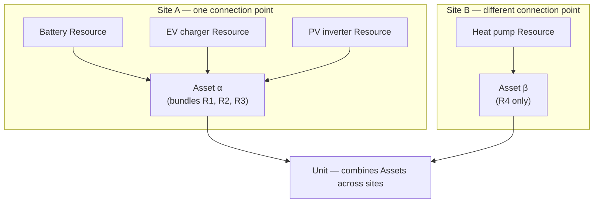

The **Asset** is the central registered entity of the flexibility market. The End-to-End Process FMR defines it as:

/

> _A generalisation of DER (in FMR-PQC) and Eligible Asset (in NESO Service Terms) — relates to a logical concept to deliver the overall usable flexibility, involving Resources together with command and control, telecommunications, and local and/or remote energy management system. An Asset represents one or more Resources that are controlled together at a single network connection point._

Three things in this definition do real work:

1. **It is a generalisation.** Existing FMRs and Service Terms use different specific terms (DER under FMR-PQC, Eligible Asset under NESO Service Terms). "Asset" is the umbrella that covers them.
2. **It is a logical concept.** An Asset isn't a physical object — it's a registered bundle that includes the Resources, the controls, the comms, and the management system. The same physical hardware could in principle support different Asset configurations.
3. **It is bounded by a single network connection point.** This is the structural rule that makes Assets meaningful. Resources behind different connection points can't be combined into one Asset (they'd be combined at the Unit level instead — see [Units](/assets/units)).

## What gets registered

When an FSP registers an Asset, the registration captures:

- The **Resources** that comprise it.
- The **network connection point** it sits behind.
- The **Metering System** approved for measuring its performance.
- The **command and control** path — how dispatch instructions reach it.
- The **telecommunications** route — how telemetry comes back.
- The **energy management system** governing how the constituent Resources act together.

Asset registration is the operational reality of the FSP–System Operator relationship. Most regulatory and contractual references to "registered flexibility" mean Asset registration.

## The "single connection point" rule

The constraint that an Asset sits at a single network connection point is the most important structural feature of the definition. Two consequences:

**A site with multiple Resources behind one connection.** Multiple Resources (e.g. battery \+ EV chargers \+ on-site PV with curtailment) can be bundled as one Asset, because they share the single connection. The FSP's energy management system orchestrates the Resources internally; the System Operator sees one Asset.

**Resources at different connection points.** These cannot be one Asset — they must be separate Assets. If they need to act together for a market product (e.g. an aggregator's portfolio of 1,000 domestic batteries), they're combined at the **Unit** level, not the Asset level.

This pattern is why Asset and Unit are separate concepts — they answer different questions. _What's bundled at one site?_ is an Asset question. _What's bundled for a Sub-Market?_ is a Unit question.

## Asset and metering

The link between Resources and the market runs through the approved Metering System. The Metering System is what transforms the Asset's behaviour into the data the System Operator uses for dispatch reconciliation and settlement.

The relevant metering arrangements include:

- **Half-Hourly (HH) settlement metering.** The standard for most flexibility products.
- **Smart-metered domestic** — increasingly capable of HH-equivalent participation.
- **Sub-metering** — separate metering of specific Resources behind a connection.
- **Telemetry-based measurement** — for Products where second-by-second data from the Asset's own systems serves as the primary or supplementary measure.

The Metering System used influences which Products the Asset is eligible for. An NHH-metered Asset can participate in a smaller range of Products than an HH-metered one.

## Settlement at the connection point

Although the FMRs frame Assets as logical entities, settlement still happens at the **network connection point** — the same point that wholesale energy settlement uses, identified by MPAN (or MSID in BSC contexts). The flexibility market currently inherits these identifiers from the wholesale settlement framework rather than maintaining its own.

This inheritance has practical implications:

- Where multiple Assets sit behind one connection point, settlement disambiguation is the FSP's responsibility, not the System Operator's.
- Cross-market reconciliation (the same connection participating in DNO and NESO products) ultimately reconciles at this connection-point level.
- Future changes to either the FMR Asset model or BSC settlement structures need to manage the boundary carefully.

## Asset lifecycle

Assets carry their own lifecycle, distinct from the underlying Resources or the Units they participate in:

- **Initial registration.** The FSP submits the Asset for inclusion in a Sub-Market.
- **Pre-qualification.** The System Operator validates that the Asset meets technical and operational requirements.
- **Active operation.** The Asset is contributing to one or more Units.
- **Modification.** Any material change — adding/removing a Resource, changing the Metering System, changing FSP — triggers a re-registration step.
- **Decommissioning.** The Asset exits the market.

Material vs. immaterial changes are themselves a live question — the boundary affects how much administrative friction sits between FSPs and updates to their portfolios.

## Related pages

- [Resources](/assets/resources) — what Assets are built from.
- [Units](/assets/units) — what Assets are combined into for market participation.
- [Registration and Qualification](/assets/registration-and-qualification) — the operational process.
- [Verification and Settlement](/mechanics/verification-and-settlement) — how Asset performance becomes payment.