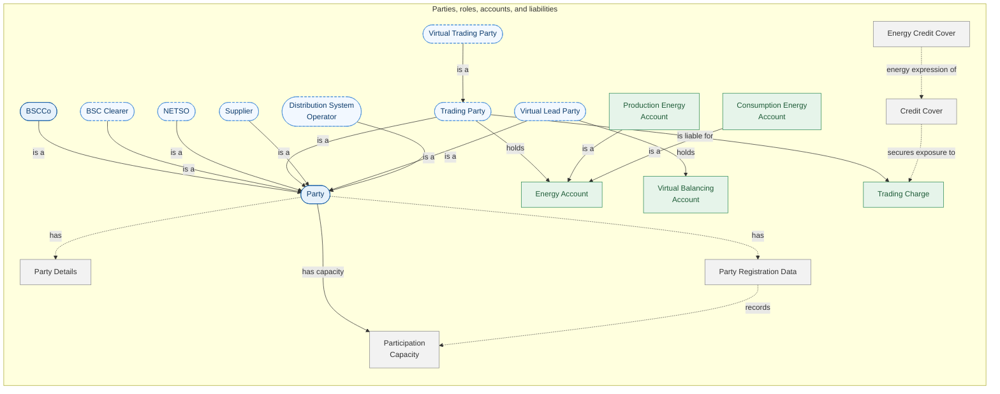
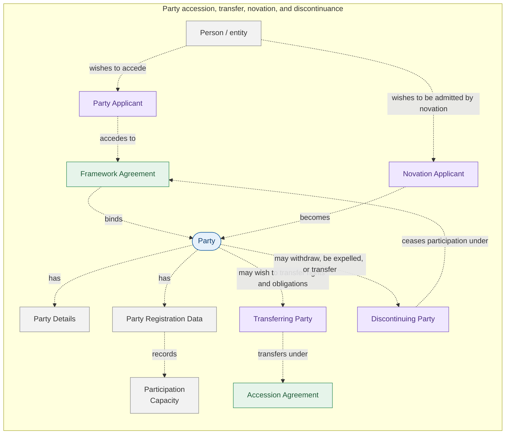
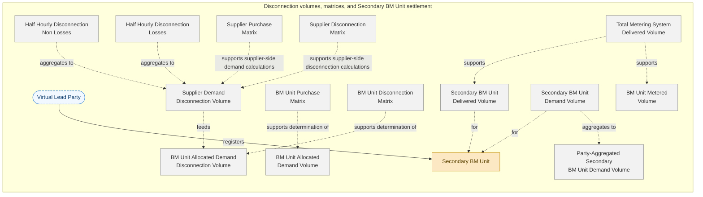

# _Generated by AI from user-created BSC context doc, pending SME validation_

These diagrams provide a high-level conceptual map of selected Balancing and Settlement Code concepts. They are intended to support taxonomy, glossary, ontology, and data-model discussions by separating legal participants, roles, accounts, BM Units, metering, balancing actions, settlement economics, SVA profiling, disconnection volumes, and party lifecycle concepts.

The diagrams distinguish between persistent participant entities, contextual roles, asset-side concepts, market-side concepts, process/time concepts, and supporting reference or calculated data. Solid arrows represent direct relationships from the supplied relationship list. Dashed arrows represent supporting, derived, aggregating, or explanatory relationships used to make the settlement structure readable.

## Visual conventions

| Style | Meaning |
| --- | --- |
| Blue rounded, solid | Actor / persistent participant entity |
| Blue rounded, dashed | Role / participation capacity |
| Amber square | Asset-side concept, including BM Units, metering systems, network points |
| Green square | Market-side concept, including accounts, prices, trades, charges |
| Purple square | Process, time period, event, or lifecycle state |
| Grey square | Reference data, calculated value, support object, or settlement property |
| Solid arrow | Direct relationship supplied in the source relation list |
| Dashed arrow | Supporting, derived, aggregating, or explanatory relationship |

---

## 1. Parties, roles, accounts, and liabilities

This diagram separates the legal idea of a Party from the participation capacities or roles that a Party can hold. It also shows the core link between Trading Parties, Energy Accounts, Trading Charges, and Credit Cover.

---

## 2. Party accession, transfer, novation, and discontinuance

This lifecycle diagram adds the concepts that sit around Party registration and ongoing participation. It is useful where the glossary needs to distinguish an entity seeking to join the BSC from one already bound by the Code, transferring obligations, or discontinuing participation.

---

## 3. BM Units, metering, network, and physical energy flow

This diagram shows how BM Units relate to Metering Systems, Boundary Points, GSP Groups, Distribution Systems, Energy Accounts, and basic import/export flow concepts.

```mermaid
flowchart LR
    subgraph physical["BM Units, metering, network, and physical energy flow"]
        BMU["BM Unit"]:::asset
        ProdBMU["Production BM Unit"]:::asset
        ConsBMU["Consumption BM Unit"]:::asset
        SuppBMU["Supplier BM Unit"]:::asset
        SecBMU["Secondary BM Unit"]:::asset
        IntBMU["Interconnector BM Unit"]:::asset

        MeterSys["Metering System"]:::asset
        SVA["SVA Metering System"]:::asset
        CVA["CVA Metering System"]:::asset
        AMS["Asset Metering System"]:::asset
        MeterEquip["Metering Equipment"]:::asset

        Boundary["Boundary Point"]:::asset
        GSP["GSP Group"]:::support
        TotalSys["Total System"]:::support
        TransSys["Transmission System"]:::asset
        DistSys["Distribution System"]:::asset
        SCP["Systems Connection Point"]:::asset

        ActiveEnergy["Active Energy"]:::support
        ActivePower["Active Power"]:::support
        Export["Export"]:::support
        Import["Import"]:::support

        MClass["Measurement Class"]:::support
        CCC["Consumption Component Class"]:::support
        PClass["Profile Class"]:::support
        LLFC["Line Loss Factor Class"]:::support
        Reg["Settlement Register"]:::support
        TPR["Time Pattern Regime"]:::support
        TeleswitchTPR["Teleswitch Time<br/>Pattern Regime"]:::support
        TeleswitchGroup["Teleswitch Group"]:::support
        SSC["Standard Settlement<br/>Configuration"]:::support

        TP(["Trading Party"]):::role
        VLP(["Virtual Lead Party"]):::role
        Supplier(["Supplier"]):::role
        DSO(["Distribution System<br/>Operator"]):::role
        PEA["Production Energy<br/>Account"]:::market
        CEA["Consumption Energy<br/>Account"]:::market

        ProdBMU -->|is a| BMU
        ConsBMU -->|is a| BMU
        SuppBMU -->|is a| BMU
        SecBMU -->|is a| BMU
        IntBMU -->|is a| BMU

        BMU -->|comprises| MeterSys
        BMU -->|associated with| Boundary
        BMU -->|registered by| TP
        BMU -->|in| GSP

        MeterSys -->|at| Boundary
        MeterSys -->|in| GSP
        MeterSys -.->|uses| MeterEquip

        SVA -->|is a| MeterSys
        CVA -->|is a| MeterSys
        AMS -->|is a| MeterSys

        SVA -->|assigned to| SuppBMU
        SVA -->|contains| Reg
        SVA -->|classified as| MClass
        SVA -->|classified as| CCC
        SVA -->|has| PClass
        SVA -->|allocated using| LLFC

        Reg -->|has| TPR
        TeleswitchTPR -->|is a| TPR
        TeleswitchTPR -.->|associated with| TeleswitchGroup
        Reg -->|associated with| SSC

        Boundary -->|in| GSP
        Boundary -->|on| DistSys
        DSO -->|operates| DistSys

        TotalSys -.->|includes| TransSys
        TotalSys -.->|includes| DistSys
        SCP -.->|connects| TransSys
        SCP -.->|connects| DistSys

        ProdBMU -->|corresponds to| PEA
        ConsBMU -->|corresponds to| CEA
        SecBMU -->|registered by| VLP
        Supplier -->|supplies to| SVA

        ProdBMU -->|delivers| Export
        ConsBMU -->|receives| Import
        Export -.->|is active energy onto system| ActiveEnergy
        Import -.->|is active energy offtaken| ActiveEnergy
        BMU -.->|has flow rate| ActivePower
    end

    classDef actor fill:#E6F1FB,stroke:#185FA5,color:#0E3D6D;
    classDef role fill:#F2F8FF,stroke:#4A90D9,color:#0E3D6D,stroke-dasharray:5 3;
    classDef asset fill:#FCE8C3,stroke:#C58A00,color:#5B4200;
    classDef market fill:#E6F4EA,stroke:#2E8B57,color:#1F5C38;
    classDef process fill:#EFE7FF,stroke:#7E57C2,color:#4B2E83;
    classDef support fill:#F2F2F2,stroke:#8A8A8A,color:#333333;

    class TP,VLP,Supplier,DSO role
    class BMU,ProdBMU,ConsBMU,SuppBMU,SecBMU,IntBMU,MeterSys,SVA,CVA,AMS,MeterEquip,Boundary,TransSys,DistSys,SCP asset
    class PEA,CEA market
    class GSP,TotalSys,ActiveEnergy,ActivePower,Export,Import,MClass,CCC,PClass,LLFC,Reg,TPR,TeleswitchTPR,TeleswitchGroup,SSC support
```

---

## 4. Balancing mechanism, notifications, and time structure

This diagram shows how BM Units interact with Bid, Offer, Bid-Offer Acceptance, FPN, Acceptance Volume, Settlement Period, Settlement Day, and related operational quantities.

```mermaid
flowchart LR
    subgraph balancing["Balancing mechanism, notifications, and time structure"]
        SDay["Settlement Day"]:::process
        SPeriod["Settlement Period"]:::process
        Quarter["Quarter Hour"]:::process
        UTCP["UTC Period"]:::process
        Spot["Spot Time"]:::process
        SPDur["Settlement Period Duration"]:::support

        BMU["BM Unit"]:::asset
        SuppBMU["Supplier BM Unit"]:::asset
        NETSO(["NETSO"]):::role

        FPN["Final Physical<br/>Notification"]:::market
        PeriodFPN["Period FPN"]:::support
        PointFPN["Point FPN"]:::support

        Bid["Bid"]:::market
        Offer["Offer"]:::market
        BOPair["Bid-Offer Pair"]:::market
        BOA["Bid-Offer Acceptance"]:::market
        AcceptData["Acceptance Data"]:::support
        AcceptVol["Acceptance Volume"]:::support

        SysAction["System Action"]:::market
        DCI["Demand Control<br/>Instruction"]:::market

        FinalDemand["Final Demand"]:::support
        BMUMV["BM Unit Metered<br/>Volume"]:::support
        BMUADV["BM Unit Allocated<br/>Demand Volume"]:::support
        BMUADDV["BM Unit Allocated Demand<br/>Disconnection Volume"]:::support
        BMUCD["BM Unit Chargeable<br/>Demand"]:::support
        BMUCreditExp["BM Unit Credit Assessment<br/>Export Capability"]:::support
        BMUCreditImp["BM Unit Credit Assessment<br/>Import Capability"]:::support

        SPeriod -->|occurs within| SDay
        Quarter -.->|subdivision of| SPeriod
        UTCP -.->|UTC expression of| SPeriod
        SPDur -.->|duration of| SPeriod
        PointFPN -.->|at| Spot

        Bid -->|submitted for| BMU
        Offer -->|submitted for| BMU
        BOPair -.->|groups| Bid
        BOPair -.->|groups| Offer

        BOA -->|accepted by| NETSO
        BOA -->|results in| AcceptVol
        AcceptData -.->|submitted by| NETSO
        BOA -.->|uses| AcceptData

        FPN -.->|for| BMU
        PeriodFPN -->|calculated for| BMU
        PointFPN -.->|point form of| FPN
        PeriodFPN -.->|period form of| FPN

        BMUMV -->|calculated for| BMU
        BMUADV -->|determines allocated demand for| SuppBMU
        DCI -.->|acts on| BMU
        SysAction -.->|acts on| BMU
        FinalDemand -.->|for| BMU
        BMUCD -.->|for| BMU
        BMUCreditExp -.->|for| BMU
        BMUCreditImp -.->|for| BMU
        BMUADDV -.->|for| SuppBMU
    end

    classDef actor fill:#E6F1FB,stroke:#185FA5,color:#0E3D6D;
    classDef role fill:#F2F8FF,stroke:#4A90D9,color:#0E3D6D,stroke-dasharray:5 3;
    classDef asset fill:#FCE8C3,stroke:#C58A00,color:#5B4200;
    classDef market fill:#E6F4EA,stroke:#2E8B57,color:#1F5C38;
    classDef process fill:#EFE7FF,stroke:#7E57C2,color:#4B2E83;
    classDef support fill:#F2F2F2,stroke:#8A8A8A,color:#333333;

    class NETSO role
    class BMU,SuppBMU asset
    class FPN,Bid,Offer,BOPair,BOA,SysAction,DCI market
    class SDay,SPeriod,Quarter,UTCP,Spot process
    class SPDur,PeriodFPN,PointFPN,AcceptData,AcceptVol,FinalDemand,BMUMV,BMUADV,BMUADDV,BMUCD,BMUCreditExp,BMUCreditImp support
```

---

## 5. Core settlement economics: prices, contracts, imbalance, cashflow, and credit

This diagram groups the main settlement properties that turn metered and contracted energy positions into imbalance, trading charges, cashflows, residual cashflows, and credit exposure.

```mermaid
flowchart LR
    subgraph settlement_core["Core settlement economics"]
        TP(["Trading Party"]):::role
        BMU["BM Unit"]:::asset
        SPeriod["Settlement Period"]:::process

        TradingCharge["Trading Charge"]:::market
        CreditCover["Credit Cover"]:::support
        EnergyCreditCover["Energy Credit Cover"]:::support

        BMUMV["BM Unit Metered<br/>Volume"]:::support
        BMUADV["BM Unit Allocated<br/>Demand Volume"]:::support

        ECV["Energy Contract Volume"]:::support
        ECVN["Energy Contract Volume<br/>Notification"]:::market
        MVRN["Metered Volume Reallocation<br/>Notification"]:::market

        EnergyImb["Energy Imbalance"]:::market
        EnergyIndebt["Energy Indebtedness"]:::support
        ActualEI["Actual Energy<br/>Indebtedness"]:::support
        MeteredEI["Metered Energy<br/>Indebtedness"]:::support

        SBP["System Buy Price"]:::market
        SSP["System Sell Price"]:::market
        ISBP["Indicative System<br/>Buy Price"]:::support
        ISSP["Indicative System<br/>Sell Price"]:::support
        IIP["Information Imbalance<br/>Price"]:::support
        VOLL["Value of Lost Load"]:::support

        PerBMUCF["Period BM Unit<br/>Cashflow"]:::support
        DailyPartyBMUCF["Daily Party BM Unit<br/>Cashflow"]:::support
        AcctEICF["Account Energy Imbalance<br/>Cashflow"]:::support
        DailyPartyEICF["Daily Party Energy<br/>Imbalance Cashflow"]:::support
        ResidualCF["Total System Residual<br/>Cashflow"]:::support

        MainFS["Main Funding Share"]:::support
        GenFS["General Funding Share"]:::support
        SVAProdFS["SVA Production<br/>Funding Share"]:::support

        TLM["Transmission Loss<br/>Multiplier"]:::support
        OTLA["Offtaking Transmission<br/>Losses Adjustment"]:::support

        ECVN -.->|notifies| ECV
        MVRN -.->|reallocates metered volume| ECV

        ECV -.->|contributes to| EnergyImb
        BMUMV -.->|contributes to| EnergyImb
        BMUADV -.->|contributes to| EnergyImb

        EnergyImb -.->|gives rise to| EnergyIndebt
        ActualEI -->|is a| EnergyIndebt
        MeteredEI -->|is a| EnergyIndebt

        SBP -->|applies in| SPeriod
        SSP -->|applies in| SPeriod
        ISBP -.->|indicative of| SBP
        ISSP -.->|indicative of| SSP
        IIP -.->|used for| EnergyImb
        VOLL -.->|parameter for scarcity pricing| SBP

        TP -->|is liable for| TradingCharge
        TradingCharge -->|calculated for| SPeriod
        EnergyIndebt -.->|feeds| TradingCharge
        TLM -.->|adjusts| TradingCharge
        OTLA -.->|adjusts| TradingCharge

        PerBMUCF -.->|for| BMU
        PerBMUCF -.->|aggregates to| DailyPartyBMUCF
        AcctEICF -.->|from| EnergyImb
        AcctEICF -.->|aggregates to| DailyPartyEICF

        TradingCharge -.->|results in| PerBMUCF
        TradingCharge -.->|results in| AcctEICF
        DailyPartyBMUCF -.->|feeds| ResidualCF
        DailyPartyEICF -.->|feeds| ResidualCF

        MainFS -.->|share of| ResidualCF
        GenFS -.->|share of| ResidualCF
        SVAProdFS -.->|share of| ResidualCF

        CreditCover -.->|covers exposure from| TradingCharge
        EnergyCreditCover -.->|energy expression of| CreditCover
        TP -.->|has exposure to| EnergyIndebt
    end

    classDef actor fill:#E6F1FB,stroke:#185FA5,color:#0E3D6D;
    classDef role fill:#F2F8FF,stroke:#4A90D9,color:#0E3D6D,stroke-dasharray:5 3;
    classDef asset fill:#FCE8C3,stroke:#C58A00,color:#5B4200;
    classDef market fill:#E6F4EA,stroke:#2E8B57,color:#1F5C38;
    classDef process fill:#EFE7FF,stroke:#7E57C2,color:#4B2E83;
    classDef support fill:#F2F2F2,stroke:#8A8A8A,color:#333333;

    class TP role
    class BMU asset
    class ECVN,MVRN,EnergyImb,SBP,SSP,TradingCharge market
    class SPeriod process
    class CreditCover,EnergyCreditCover,BMUMV,BMUADV,ECV,EnergyIndebt,ActualEI,MeteredEI,ISBP,ISSP,IIP,VOLL,PerBMUCF,DailyPartyBMUCF,AcctEICF,DailyPartyEICF,ResidualCF,MainFS,GenFS,SVAProdFS,TLM,OTLA support
```

---

## 6. SVA settlement, profiling, annualisation, and GSP Group correction

This diagram groups the major SVA settlement properties used to derive metered, profiled, supplier, BM Unit, and GSP Group consumption quantities.

```mermaid
flowchart LR
    subgraph profiling["SVA settlement, profiling, annualisation, and GSP Group correction"]
        SVA["SVA Metering System"]:::asset
        Reg["Settlement Register"]:::support
        Supplier(["Supplier"]):::role
        DA(["Data Aggregator"]):::role
        HHDA(["Half Hourly Data<br/>Aggregator"]):::role
        SVAA(["Supplier Volume<br/>Allocation Agent"]):::role
        PA(["Profile Administrator"]):::role
        TempProv(["Temperature Provider"]):::role

        HHConsNL["Half Hourly Consumption<br/>Non Losses"]:::support
        HHConsL["Half Hourly Consumption<br/>Losses"]:::support
        BMUMeteredCons["BM Unit Metered<br/>Consumption"]:::support
        BMUMeteredConsL["BM Unit Metered<br/>Consumption Losses"]:::support
        BMUProfiledCons["BM Unit Profiled<br/>Consumption"]:::support
        SupplierMeteredCons["Supplier Metered<br/>Consumption"]:::support
        SupplierMeteredConsL["Supplier Metered<br/>Consumption Losses"]:::support
        SupplierMSCons["Supplier Metering System<br/>Metered Consumption"]:::support
        SupplierDeemedTake["Supplier Deemed Take"]:::support

        GSPTake["GSP Group Take"]:::support
        GSPCorr["GSP Group Correction<br/>Factor"]:::support
        GSPHHCons["GSP Group Half Hourly<br/>Consumption"]:::support
        GSPScale["GSP Group Correction<br/>Scaling Weight"]:::support
        GSPTemp["GSP Group Measured<br/>Temperature"]:::support
        ERADPC["Estimated Regional Average<br/>Demand Per Customer"]:::support

        EAC["Estimated Annual<br/>Consumption"]:::support
        AA["Annualised Advance"]:::support
        MeterAdv["Meter Advance"]:::support
        AAAF["Annualised Advance<br/>Adjustment Factor"]:::support
        TotalAA["Total Annualised<br/>Advance"]:::support
        TotalMEAC["Total Metered Estimated<br/>Annual Consumption"]:::support

        BPPC["Basic Period Profile<br/>Coefficient"]:::support
        BLPC["Baseload Profile<br/>Coefficient"]:::support
        SLPC["Switched Load Profile<br/>Coefficient"]:::support
        RegCoeff["Regression Coefficients"]:::support
        AFYC["Average Fraction Of<br/>Yearly Consumption"]:::support
        BaseFrac["Base Fraction"]:::support
        SwitchedFrac["Switched Fraction"]:::support

        Smooth["Smoothing Parameter"]:::support
        Threshold["Threshold Parameter"]:::support

        HHDA -->|is a| DA
        SVA -->|aggregated by| DA
        GSPTake -->|submitted to| SVAA
        PA -->|produces| BPPC
        TempProv -->|provides| GSPTemp
        Supplier -->|has| SupplierDeemedTake

        SVA -.->|metered consumption for| SupplierMSCons
        SupplierMSCons -.->|aggregates to| SupplierMeteredCons
        SupplierMeteredConsL -.->|losses component of| SupplierMeteredCons
        SupplierMeteredCons -.->|contributes to| SupplierDeemedTake

        SVA -.->|contributes to| HHConsNL
        SVA -.->|contributes to| HHConsL
        HHConsNL -.->|aggregates to| GSPHHCons
        HHConsL -.->|aggregates to| GSPHHCons
        GSPHHCons -.->|adjusted by| GSPCorr
        GSPScale -.->|used in| GSPCorr
        GSPTake -.->|used in| GSPCorr

        SVA -.->|contributes to| BMUMeteredCons
        BMUMeteredConsL -.->|losses component of| BMUMeteredCons
        BMUMeteredCons -.->|feeds| BMUProfiledCons

        MeterAdv -.->|used in| AA
        AA -.->|used in| EAC
        AAAF -.->|adjusts| EAC
        Smooth -.->|parameter for| AAAF
        Threshold -.->|parameter for| EAC

        EAC -.->|aggregates to| TotalMEAC
        AA -.->|aggregates to| TotalAA

        BPPC -.->|supports| BMUProfiledCons
        BLPC -.->|specialisation of| BPPC
        SLPC -.->|supports| BMUProfiledCons
        RegCoeff -.->|supports| BPPC
        AFYC -.->|supports allocation across| Reg
        BaseFrac -.->|supports| BLPC
        SwitchedFrac -.->|supports| SLPC
        ERADPC -.->|supports profiling| BPPC
        GSPTemp -.->|supports profiling| BPPC
    end

    classDef actor fill:#E6F1FB,stroke:#185FA5,color:#0E3D6D;
    classDef role fill:#F2F8FF,stroke:#4A90D9,color:#0E3D6D,stroke-dasharray:5 3;
    classDef asset fill:#FCE8C3,stroke:#C58A00,color:#5B4200;
    classDef market fill:#E6F4EA,stroke:#2E8B57,color:#1F5C38;
    classDef process fill:#EFE7FF,stroke:#7E57C2,color:#4B2E83;
    classDef support fill:#F2F2F2,stroke:#8A8A8A,color:#333333;

    class Supplier,DA,HHDA,SVAA,PA,TempProv role
    class SVA asset
    class Reg,HHConsNL,HHConsL,BMUMeteredCons,BMUMeteredConsL,BMUProfiledCons,SupplierMeteredCons,SupplierMeteredConsL,SupplierMSCons,SupplierDeemedTake,GSPTake,GSPCorr,GSPHHCons,GSPScale,GSPTemp,ERADPC,EAC,AA,MeterAdv,AAAF,TotalAA,TotalMEAC,BPPC,BLPC,SLPC,RegCoeff,AFYC,BaseFrac,SwitchedFrac,Smooth,Threshold support
```

---

## 7. Disconnection volumes, matrices, and Secondary BM Unit settlement

This diagram isolates disconnection-related settlement properties and the Secondary BM Unit delivered and demand volume concepts.

---

## Reading notes

These diagrams are not intended to be a full formal ontology. They are a readable conceptual bridge between BSC glossary terms, settlement calculation objects, and future machine-readable modelling work. Where the relationship list provided an explicit relationship, the diagram uses a solid edge. Where the diagram introduces a dependency, grouping, aggregation, or calculation-support link for readability, the edge is dashed.

For ontology development, the next step would be to convert these concepts into stable identifiers and then separate:

- classes, such as Party, BM Unit, Metering System, Settlement Period;
- properties, such as BM Unit Metered Volume, System Buy Price, Supplier Deemed Take;
- relationships, such as registered by, assigned to, occurs within, calculated for;
- constraints, such as valid participation capacities, permitted BM Unit types, and time-granularity rules.