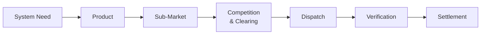

The mechanics of the flexibility market follow a sequence: a system need is identified, a product is defined to meet it, a sub-market is established to procure that product, FSPs compete to win trades, those trades are dispatched, and delivery is verified and settled.

## The mechanics chain

Each link in the chain is a separate concern with its own governance, its own actors, and often its own systems.

## What sits at each link

<CardGroup cols={2}>
  <Card title="Needs and Products" href="/mechanics/needs-and-products">
    How a system operator turns a network or system requirement into a procurable product.
  </Card>

  <Card title="Sub-Markets" href="/mechanics/sub-markets">
    The specific procurement vehicles by which products are bought, parameterised by duration, location, and other dimensions.
  </Card>

  <Card title="Competition and Clearing" href="/mechanics/competition-and-clearing">
    Buy and sell signalling, bid submission, market clearing, and trade allocation.
  </Card>

  <Card title="Dispatch" href="/mechanics/dispatch">
    How traded flexibility is converted into instructions to assets and physical delivery.
  </Card>
</CardGroup>

The chain ends with [Verification and Settlement](/mechanics/verification-and-settlement) — the assessment of whether what was contracted was delivered, and the financial reconciliation that follows.

## Why the chain matters

The chain is sequential by design — each link constrains what's possible at the next one. A product that isn't well-specified leads to ambiguous bids. A sub-market that's poorly designed leads to thin liquidity. A clearing mechanism that doesn't reflect physical realities leads to undeliverable trades.

Most market design improvements work by adjusting one link without breaking its connection to the others. This is harder than it looks, because the chain is also where most of the market's heterogeneity sits — different system operators run the chain differently, with different timings, different rules, and different terminology for the same underlying steps.

## Heterogeneity is the rule

Across the GB flex market there are dozens of variations of this chain in active operation. NESO's Dynamic Containment runs the chain on a sub-second timescale; a DNO's long-term constraint management contract runs it across years. Both are recognisable as the same mechanics, but the implementations differ at every link.

This heterogeneity is a feature, not a bug — different system needs require different procurement approaches. But it is also the reason FSPs invest heavily in understanding multiple flavours of the chain, and the reason coordination programmes like FMAR exist.

## Related pages

- [Lifecycle: Overview](/lifecycle/overview) — the same mechanics seen from the perspective of a single asset's journey.
- [System Operators](/actors/system-operators) — the parties that run the chain on the buy side.
- [Service Providers](/actors/service-providers) — the parties that engage with it on the sell side.