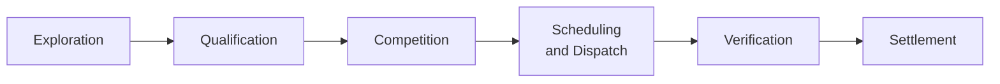

The flexibility market lifecycle is the sequence an asset moves through from before any trade exists to after the money has been paid. Six phases, in order, each with its own actors, activities, and time horizons.

## The six phases

| Phase | Purpose | Time horizon |
| --- | --- | --- |
| **Exploration** | Identify needs; define products | Months to years |
| **Qualification** | Register and pre-qualify | Weeks to months |
| **Competition** | Buy/sell signalling and clearing | Hours to months |
| **Scheduling and Dispatch** | Operational delivery | Real-time |
| **Verification** | Performance assessment | Days to weeks |
| **Settlement** | Invoice and payment | Weeks |

The phases overlap in calendar time. While one trade is being settled, another is being dispatched, a third is being cleared, and a fourth's product is still being explored. From a single asset's perspective, the phases happen sequentially; from the market's perspective, all phases are happening at once.

## Sub-pages

<CardGroup cols={2}>
  <Card title="Phases" href="/lifecycle/phases">
    Detail on each of the six phases, what happens, and who does what.
  </Card>

  <Card title="Activity Dependencies" href="/lifecycle/activity-dependencies">
    The 29 standard activities and how they connect across the lifecycle.
  </Card>

  <Card title="Sub-Market Variation" href="/lifecycle/sub-market-variation">
    How the lifecycle varies between sub-markets, and why most variation is smaller than it appears.
  </Card>
</CardGroup>

## Why the lifecycle view matters

The lifecycle view complements the [Mechanics](/mechanics/overview) view. Mechanics asks "what is the chain of buying and selling?"; lifecycle asks "what does an asset go through?". Both views describe the same reality from different angles.

The lifecycle view is particularly useful for:

- **Onboarding.** Understanding what an FSP needs to do to bring a new asset into the market.
- **Programme planning.** Knowing where in the lifecycle a proposed change has its impact.
- **Cross-market analysis.** Identifying where the lifecycle is similar or different across sub-markets.
- **Coordination work.** Programmes like FMAR specifically target lifecycle stages where coordination would have the most leverage (notably Qualification).

## Related pages

- [Market Mechanics](/mechanics/overview) — the same activity seen from the market's perspective.
- [Registration and Qualification](/assets/registration-and-qualification) — the Qualification phase in operational detail.