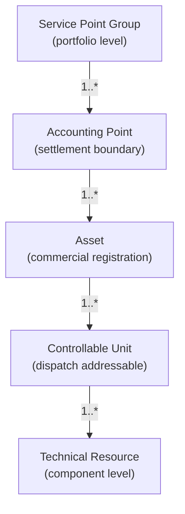

In the GB flexibility market, "asset" is a slippery word. It means different things at different levels of detail, and understanding the levels is the foundation for understanding everything from registration to settlement.

## The asset hierarchy

This four-level hierarchy is aligned with the Norwegian Flexibility Information System (FIS / EuroFlex) — the most mature international reference for flexibility data modelling. GB-specific terminology overlays on this structure but the levels themselves are stable.

## What each level is for

- [**Service Point Group (SPG)**](/assets/hierarchy) — portfolio-level grouping for collective participation and reporting.
- [**Accounting Point (AP)**](/assets/accounting-points) — the settlement boundary; where energy is metered and money flows.
- **Asset** — the commercial registration; what an FSP signs up to operate in a market.
- [**Controllable Unit (CU)**](/assets/controllable-units) — the unit that receives dispatch instructions and reports performance.
- **Technical Resource (TR)** — the lowest-level technical component (an individual inverter, a single battery cell rack).

The hierarchy isn't strict — not every situation involves all five levels. A simple domestic battery might collapse to one of each, while a complex industrial site might have a deeply nested structure.

## Why the levels are kept distinct

Each level has independent characteristics that justify its existence:

- **Independent lifecycles.** APs change ownership and configuration on a different timescale than the Assets behind them. CUs can be added or removed without changing the Asset's identity.
- **Independent governance.** FSPs have authority over Asset registration and capability declarations; network operators have authority over AP-level data; OEMs may govern TR-level firmware.
- **Independent identity.** Each level needs to be uniquely identifiable for its own purposes — APs for settlement, CUs for dispatch, Assets for commercial accounting.

Conflating levels (treating an AP as just an attribute of an Asset, for example) tends to break down at any complex site or any change of state. The cost of structural clarity is upfront modelling work; the cost of conflation is operational pain that lasts forever.

## Sub-pages

<CardGroup cols={2}>
  <Card title="Hierarchy" href="/assets/hierarchy">
    The four-level asset hierarchy in detail, with examples.
  </Card>

  <Card title="Accounting Points" href="/assets/accounting-points">
    The settlement boundary — how APs work and why they matter.
  </Card>

  <Card title="Controllable Units" href="/assets/controllable-units">
    The dispatch-addressable level — how CUs are defined and used.
  </Card>

  <Card title="Registration and Qualification" href="/assets/registration-and-qualification">
    The operational process by which assets become market-eligible.
  </Card>
</CardGroup>

## Related pages

- [Lifecycle](/lifecycle/overview) — what happens to an asset once it's structurally defined.
- [Dispatch](/mechanics/dispatch) — how the asset hierarchy is used at delivery time.
- [Verification and Settlement](/mechanics/verification-and-settlement) — how it's used at settlement time.