This page sets out the **working FMAR data model** \[as per Working Group 4/5/6\]— the entity-relationship view of what FMAR will hold as the authoritative system of record for GB flexibility market participants, assets, units, and qualifications.

The model is **under active development**. Entity names, attributes, and cardinalities are expected to evolve as design work proceeds and as the wider Flexibility Market Rules mature around it. This page is intended as a current snapshot and a reference for shared understanding across the programme. The FMAR data model is the most concrete expression of "Flex World" — the semantic universe described at higher level on the [Master Conceptual Map](/master-conceptual-map).

## How to use this page

Three audiences and three things to look for:

- **If you're working on a Workgroup paper or rule change:** entity names and definitions here are the canonical FMAR vocabulary. The wider Flex World — FMR-GLO terms, NESO procurement terms, the Standard Agreement — has its own vocabulary; the [Glossary](/reference/glossary) tracks how these relate.
- **If you're designing or integrating with FMAR:** the attribute lists and cardinalities here are what the system will hold. Treat them as design-stage, not committed.
- **If you're an observer of Flex World:** the cross-references at the end of eachoueshold section show how FMAR concepts connect to FMRs, NESO procurement vocabulary, BSC settlement, and the adjacent CCS and DSI ecosystems.

## The model

```mermaid
erDiagram

    FLEXIBILITY_ORGANISATION {
        string companyName
		string companyName

        string companyNumber
        string registeredAddressLine1
        string registeredAddressLine2
        string registeredAddressLine3
        string registeredPostcode
        string organisationWebsite
        string vatRegistrationNumber
        string organisationLifecycleStatus
    }

    FLEXIBILITY_MARKET_ROLE {
        string flexibilityMarketRoleName
    }

    FLEXIBILITY_PARTICIPANT_ROLE {
        string fmarParticipantRoleIdentifier
        string participantRoleStatus
    }

    FLEXIBILITY_SERVICE_PROVIDER {
        string fmarFspIdentifier
    }

    SYSTEM_OPERATOR {
        string fmarSoIdentifier
    }

    NATIONAL_ELECTRICITY_SYSTEM_OPERATOR {
        string nesoIdentifier
        string companyNumber
    }

    DISTRIBUTION_NETWORK_OPERATOR {
        string dnoIdentifier
    }

    FSP_REGISTRATION {
        boolean contractualAcceptanceIndicator
        boolean submissionDeclarationIndicator
        string firstName
        string lastName
        string emailAddress
        string telephoneNumber
        string organisationReference
        boolean flexAssureMembershipIndicator
        string achillesUvdbRegistrationNumber
        boolean creditCheckAcknowledgementIndicator
        boolean receivershipIndicator
        boolean administrationIndicator
        boolean liquidationIndicator
        boolean debtPaymentFailureIndicator
        boolean windingUpPetitionIndicator
        boolean bankruptcyPetitionIndicator
        boolean regulatoryOffenceIndicator
        boolean contractTerminationIndicator
        boolean materialLitigationIndicator
        boolean employersLiabilityInsuranceCoverageIndicator
        boolean publicLiabilityInsuranceCoverageIndicator
        boolean insuranceDocumentationProvisionIndicator
        string fspRegistrationStatus
    }

    FSP_QUALIFICATION {
        string fspQualificationStatus
    }

    CONSUMER {
        boolean consumerConsentIndicator
    }

    FLEXIBILITY_TECHNICAL_RESOURCE {
        string energyConversionType
        string demandTechnologyType
        string energySourceType
        string resourceName
        float installedCapacity
    }

    FLEXIBILITY_ASSET {
        string fmarAssetIdentifier
        string assetName
        boolean generationOrStorageIndicator
        boolean demandIndicator
        float installedCapacityMW
        float flexibleActiveDemandTurnUpMW
        float flexibleActiveDemandTurnDownMW
        float flexibleActiveGenerationTurnUpMW
        float flexibleActiveGenerationTurnDownMW
        float reactiveExportGenerationTurnUpMVar
        float reactiveImportGenerationTurnDownMVar
        string minimumOperatingDuration
        string maximumOperatingDuration
        string minimumResponseTime
        string recoveryTime
        string assetLifecycleStatus
    }

    FLEXIBILITY_ASSET_RELATIONSHIP {
        string relationshipType
        string relationshipLifecycleStatus
    }

    FLEX_ASSET_REGISTRATION {
        string connectionOfferStatusType
        date targetDeliveryDate
        string plannedConnectionIdentifier
        string awaitingEnergisationConnectionIdentifier
        date firmDateOfEnergisation
        string connectionStatusType
        date serviceReadinessDate
        string recruitmentStatusType
        string assetReferenceIdentifier
        string plannedConnectionVoltage
        string registrationLifecycleStatus
    }

    ASSET_QUALIFICATION {
        string assetQualificationLifecycleStatus
    }

    FLEXIBILITY_UNIT {
        string unitLifecycleStatus
    }

    UNIT_QUALIFICATION {
        string qualificationLifecycleStatus
    }

    FLEXIBILITY_METERING_ARRANGEMENT {
        string meteringArrangementType
        string meteringGranularity
        string meteringArrangementLifecycleStatus
    }

    BOUNDARY_LEVEL_METERING_POINT {
        string importMpanIdentifier
        string exportMpanIdentifier
        string meteringSystemIdentifier
        string boundaryPointStatus
        string connectionVoltage
    }

    ASSET_LEVEL_METERING_POINT {
        string assetMeteringSystemIdentifier
        string assetMeteringSystemStatus
        string submeterSerialNumber
    }

    PREMISES {
        string assetScaleType
        string buildingNumber
        string siteName
        string streetName
        string townOrCity
        string county
        string postcode
        string country
        float latitude
        float longitude
    }

    DISTRIBUTION_NETWORK {
        string gspGroupId
    }

    DISTRIBUTION_NETWORK_CONNECTION {
        string constraintManagementZone
        string nearestNodeIdentifier
    }

    TRANSMISSION_NETWORK_CONNECTION {
        string gridSupplyPoint
    }

    FLEXIBILITY_SUB_MARKET {
        string mfSubMarketIdentifier
    }

    FLEXIBILITY_PRODUCT {
        string mfProductIdentifier
    }

    %% Core organisation / role model
    FLEXIBILITY_ORGANISATION ||--o{ FLEXIBILITY_PARTICIPANT_ROLE : "can perform"
    FLEXIBILITY_MARKET_ROLE ||--o{ FLEXIBILITY_PARTICIPANT_ROLE : "defines role"
    FLEXIBILITY_PARTICIPANT_ROLE ||--o| FLEXIBILITY_SERVICE_PROVIDER : "may be"
    FLEXIBILITY_PARTICIPANT_ROLE ||--o| SYSTEM_OPERATOR : "may be"
    SYSTEM_OPERATOR ||--o| NATIONAL_ELECTRICITY_SYSTEM_OPERATOR : "is a type of"
    SYSTEM_OPERATOR ||--o| DISTRIBUTION_NETWORK_OPERATOR : "is a type of"

    %% FSP qualification model
    FLEXIBILITY_SERVICE_PROVIDER ||--o{ FSP_REGISTRATION : "submits"
    SYSTEM_OPERATOR ||--o{ FSP_REGISTRATION : "receives"
    FSP_REGISTRATION ||--o| FSP_QUALIFICATION : "results in"
    SYSTEM_OPERATOR ||--o{ FSP_QUALIFICATION : "qualifies"
    FLEXIBILITY_SERVICE_PROVIDER ||--o{ FSP_QUALIFICATION : "is qualified by"

    %% Asset ownership / control model
    CONSUMER ||--o{ FLEXIBILITY_TECHNICAL_RESOURCE : "owns"
    FLEXIBILITY_TECHNICAL_RESOURCE }o--|| FLEXIBILITY_ASSET : "can be grouped into"
    FLEXIBILITY_SERVICE_PROVIDER ||--o{ FLEXIBILITY_ASSET_RELATIONSHIP : "has relationship"
    FLEXIBILITY_ASSET ||--o{ FLEXIBILITY_ASSET_RELATIONSHIP : "is subject of"
    FLEXIBILITY_SERVICE_PROVIDER ||--o{ FLEX_ASSET_REGISTRATION : "submits"
    FLEXIBILITY_ASSET ||--o{ FLEX_ASSET_REGISTRATION : "is registered through"
    SYSTEM_OPERATOR ||--o{ FLEX_ASSET_REGISTRATION : "receives"
    FLEX_ASSET_REGISTRATION ||--o{ ASSET_QUALIFICATION : "may be qualified as"
    SYSTEM_OPERATOR ||--o{ ASSET_QUALIFICATION : "qualifies"
    FLEXIBILITY_ASSET ||--o{ ASSET_QUALIFICATION : "has qualification"

    %% Unit and product qualification model
    FLEXIBILITY_UNIT }o--o{ ASSET_QUALIFICATION : "groups qualified assets"
    FLEXIBILITY_UNIT ||--o{ UNIT_QUALIFICATION : "has qualification"
    SYSTEM_OPERATOR ||--o{ UNIT_QUALIFICATION : "qualifies"
    FLEXIBILITY_PRODUCT ||--o{ UNIT_QUALIFICATION : "qualification for product"
    FLEXIBILITY_SUB_MARKET ||--o{ FLEXIBILITY_PRODUCT : "supports"
    SYSTEM_OPERATOR ||--o{ FLEXIBILITY_SUB_MARKET : "operates"
    FLEXIBILITY_PRODUCT ||--o{ FLEXIBILITY_UNIT : "procures units for"

    %% Metering and network location model
    FLEXIBILITY_ASSET ||--|| FLEXIBILITY_METERING_ARRANGEMENT : "measured by"
    FLEXIBILITY_METERING_ARRANGEMENT }o--o{ BOUNDARY_LEVEL_METERING_POINT : "uses"
    FLEXIBILITY_METERING_ARRANGEMENT ||--o| ASSET_LEVEL_METERING_POINT : "may use"
    PREMISES ||--o{ BOUNDARY_LEVEL_METERING_POINT : "has"
    BOUNDARY_LEVEL_METERING_POINT ||--o| DISTRIBUTION_NETWORK_CONNECTION : "located within"
    DISTRIBUTION_NETWORK_CONNECTION }o--|| DISTRIBUTION_NETWORK : "part of"
    DISTRIBUTION_NETWORK_OPERATOR ||--o{ DISTRIBUTION_NETWORK : "operates"
    TRANSMISSION_NETWORK_CONNECTION ||--o{ DISTRIBUTION_NETWORK : "connects to"
```



## The model in five sub-models

The diagram above can be read as five overlapping sub-models, each anchoring a specific operational concern. They are not independent — they share entities — but separating them helps to navigate the model.

1. **Core organisation / role model** — who is who, and what role they hold.
2. **FSP qualification model** — how a Flexibility Organisation becomes a registered, qualified FSP.
3. **Asset ownership / control model** — how Consumers, Resources, Assets, and FSPs relate.
4. **Unit and product qualification model** — how Assets are aggregated into Units and qualified for Products in Sub-Markets.
5. **Metering and network location model** — where Assets sit on the network and how they're metered.

Each sub-model is described below with notes on cross-references to Flex World.

### 1. Core organisation / role model

The starting point. A **Flexibility Organisation** is a Companies-House-registered company operating within the Flexibility Market. It can hold one or more **Flexibility Participant Roles** at any time. Each Participant Role is a specific instance of a **Flexibility Market Role** (a defined role that can be performed — e.g. FSP, PSO, CSO).

The Participant Role then specialises into either a **Flexibility Service Provider** or a **System Operator**. The latter further specialises into **NESO** or a **DNO**.

**Note on cross-references to Flex World:**

- This sub-model is the formal expression of the **Actor vs Role** distinction set out on the [Master Conceptual Map](/master-conceptual-map). Flexibility Organisation is the Actor class; Flexibility Participant Role is the Role. The same Flexibility Organisation can hold multiple Roles — e.g. a DNO that is concurrently a PSO and a CSO.
- The model currently only specialises the System Operator role into NESO/DNO. The PSO/CSO distinction discussed in the Master Conceptual Map is not yet a separate entity here — it would currently be carried by the `flexibilityMarketRoleName` attribute on Flexibility Market Role. Worth flagging as an open design point.
- The Market Operator role (in its five phase-specific sub-roles: Upstream Registration, Qualification, Dispatch, Verification, Settlement Systems) doesn't appear in the model at all. Likely because FMAR itself is the Upstream Registration system and the others sit outside FMAR's scope — but if Market Operator is a Role any Flexibility Organisation can hold, it deserves representation.
- The Independent Market Platform actor class (Piclo, Electron, etc.) — currently held as an Actor in the Master Conceptual Map — doesn't appear here. IMPs are Flexibility Organisations that hold the Market Operator role; once Market Operator is modelled, IMPs are implicitly captured.

### 2. FSP qualification model

A Flexibility Service Provider submits an **FSP Registration** to a System Operator. The Registration is a fact-laden record — its attributes carry the entire commercial qualification surface, including:

- Commercial standing indicators (credit check, receivership, administration, liquidation, debt payment failure, winding-up petition, bankruptcy petition).
- Conduct indicators (regulatory offence, contract termination, material litigation).
- Insurance coverage (employers' liability, public liability, documentation provision).
- External assurance memberships (FlexAssure membership; Achilles UVDB registration number).

If the Registration is accepted, it results in an **FSP Qualification** — the SO's formal recognition that the FSP can operate in the Sub-Markets the SO is responsible for.

**Note on cross-references to Flex World:**

- This is the data model implementation of activity **Q.1 Register Service Provider** and **Q.2 Qualify Commercially** in the [End-to-End Process FMR](/lifecycle/activity-dependencies).
- The FSP Registration attribute list overlaps significantly with the commercial pre-qualification criteria in **FMR-PQC**. The FMR is the policy source; FMAR is where the answers are recorded against it. If FMR-PQC's criteria evolve, FSP Registration's attribute set evolves with it — a coupling worth being explicit about in the change process.
- The relationship between FSP Qualification and the _Standard Agreement_ is not modelled. The Qualification record formally authorises participation but the contractual instrument (the Standard Agreement) is separate. The model has no explicit hook for SA signature, version, or status — which connects to the "FMR vs SA prevailing terms" question being worked through in the change framework.
- Several attributes (FlexAssure membership, Achilles UVDB) reference external industry schemes that FMAR will need to integrate with.

### 3. Asset ownership / control model

The core of the model. A **Consumer** owns one or more **Flexibility Technical Resources** (physical hardware — batteries, EV chargepoints, heat pumps, generators). One or many Resources are grouped into a **Flexibility Asset** — the logical, controllable, dispatchable bundle.

An FSP's relationship to an Asset is modelled explicitly through **Flexibility Asset Relationship** — typed as Owner, Operator, or Aggregator. The FSP then submits a **Flex Asset Registration** to a System Operator, requesting that the Asset be qualified for use in a Sub-Market. If the SO approves, the result is an **Asset Qualification**.

The Flexibility Asset itself carries a rich technical attribute set — directional capacities (active demand turn-up/turn-down, active generation turn-up/turn-down, reactive equivalents), operational characteristics (minimum/maximum operating duration, response time, recovery time), and installed capacity. These are the operational parameters by which the Asset's capabilities are made visible to procurement.

**Note on cross-references to Flex World:**

- The Resource → Asset → Unit hierarchy is the GB FMR's three-level model and is foreshadowed here in the Resource → Asset relationship; the Asset → Unit step is in the next sub-model.
- The Flexibility Asset Relationship entity is the _explicit semantic carrier_ of what the Standard Agreement currently expresses contractually — the FSP–Asset Owner commercial relationship. This is a Flex World vocabulary alignment worth flagging: SA-prose vocabulary like "appointment", "delegation", "agency" maps onto the structured `relationshipType` field here.
- The Flex Asset Registration entity is the data model implementation of activity **Q.5 Register Assets**; Asset Qualification implements **Q.6 Pre-Qualify Assets** plus **Q.9 Pre-Qualify Grid** (since the Connecting System Operator's grid validation contributes to Asset Qualification).
- Notably, the model has **no Plant or Apparatus entity**. The Flexibility Technical Resource is the FMAR equivalent. BSC's "Plant and Apparatus" vocabulary is referenced in the FMR-E2E Resource definition but doesn't appear as a separate FMAR entity.
- The Consumer entity carries a `consumerConsentIndicator` — a boolean. The CCS adjacent ecosystem (Consent and Credential Service) provides industry-grade infrastructure for managing those consents; FMAR's `consumerConsentIndicator` is the FMAR-side reflection of CCS-held consent status. A future integration point.

### 4. Unit and product qualification model

A **Flexibility Unit** groups one or more Asset Qualifications (i.e. already-pre-qualified Assets). The Unit is then qualified through **Unit Qualification** for a specific **Flexibility Product**, which is in turn supported by a **Flexibility Sub-Market** operated by a System Operator.

This is the FMAR data model's "market-facing" layer — the structures that connect FMAR's asset registry to the procurement environment.

**Note on cross-references to Flex World:**

- This is the data model implementation of activities **Q.7 Register Units** and **Q.8 Pre-Qualify Units**, leading into the Competition phase (C.1–C.3 — Buy/Sell Requirements and Market Clearing).
- Flexibility Unit is the GB FMR umbrella generalising NESO **Auction Unit**, NESO **BR Unit**, NESO **DFS Unit**, and DNO **Asset Group**. These procurement-specific terms (well-defined in the NESO procurement glossary tab) are not separate FMAR entities — they're the same Flexibility Unit entity used in different procurement contexts.
- Flexibility Product is a first-class FMAR entity with an `mfProductIdentifier`. This is the bridge between the FMAR-held asset side and the FMR-PD-defined Product specifications (OU, PR, SAOU, SU, VAOU). The identifier provides the canonical reference Sub-Market platforms will use.
- Flexibility Sub-Market is similarly a first-class FMAR entity. The [Sub-Market Catalogue](/reference/sub-market-catalogue) lists the operational Sub-Markets — each will correspond to a Flexibility Sub-Market record in FMAR with an `mfSubMarketIdentifier`.
- The cardinality `FLEXIBILITY_PRODUCT ||--o{ FLEXIBILITY_UNIT : "procures units for"` is worth pausing on: a Product procures multiple Units, but a Unit qualifies for one Product (per `UNIT_QUALIFICATION`). An Asset participating in multiple Sub-Markets needs to be part of multiple Units. This is structurally how value-stacking (Co-delivery / Splitting / Jumping, per FMR-RSR) is supported at the data model level.
- The Baseline Method is _not_ modelled here. FMR-SBM defines a full vocabulary (DBM, ABM, CBM, plus the techniques Nomination, Recent History, Fixed Reference, Asset Capacity, Zero) and Q.11 Register Baseline Method places this in the Qualification activity sequence — but there's no Baseline Method entity in the data model yet. Likely a forthcoming addition.

### 5. Metering and network location model

A Flexibility Asset is measured by a **Flexibility Metering Arrangement**, which uses a **Boundary Level Metering Point** (at the connection point) and/or one or more **Asset Level Metering Points** (sub-metering specific Assets behind the boundary).

Boundary Level Metering Points carry `importMpanIdentifier` and `exportMpanIdentifier` — the BSC settlement identifiers — and are located in **Premises** that sit on a **Distribution Network Connection**, which is part of a **Distribution Network** operated by a DNO and connected upstream via a **Transmission Network Connection**.

**Note on cross-references to Flex World:**

- This sub-model is FMAR's interface with the BSC settlement framework. MPAN is the wholesale settlement identifier; FMAR holds it as the bridge from the FMAR Asset model to the BSC settlement boundary. This is the "settlement boundary" question discussed in the [Reference Models](/reference/reference-models) cross-walk to FIS — the Accounting Point concept FIS makes explicit is implicit in this model, carried as MPAN on the Boundary Level Metering Point.
- The Distribution Network Connection entity carries `constraintManagementZone` — placing the Asset within a specific CMZ for the purposes of DNO Sub-Markets. This is the data model implementation of the CMZ concept that appears on the Master Conceptual Map as a Sub-Market attribute.
- BSC-derived identifiers — MPAN at the boundary, MSID for asset metering — are how FMAR settlement-time references reconcile with BSC settlement. Settlement disambiguation (where multiple Assets sit behind one MPAN) is the FSP's responsibility, not FMAR's.
- Asset Metering Systems (BSC AMSID-style sub-metering) are modelled here via Asset Level Metering Point. The DFS Procurement Rules concepts of Boundary Meter / Sub-Meter / Related Sub-Meters operationalise this same physical setup with NESO-specific semantics.
- The Premises entity carries postal address attributes plus latitude/longitude. This is the spatial anchor — and is also the entity the PAS 1878 definition of "premises" maps to (although the PAS framing is appliance-centric and the FMAR framing is connection-centric).

## Open design points

A few aspects of the model that are visible-but-incomplete and likely to evolve:

- **Lifecycle status fields are pervasive but unmodelled.** Almost every entity carries a `*LifecycleStatus` attribute (organisation, FSP registration, FSP qualification, asset, asset relationship, registration, asset qualification, unit, unit qualification, metering arrangement). The valid states and transitions for each aren't yet modelled here — a state model for each would significantly tighten the data model.
- **No Market Operator entity.** As noted under Sub-model 1.
- **No PSO / CSO specialisation.** As noted under Sub-model 1 — the distinction is currently carried by the `flexibilityMarketRoleName` attribute rather than a separate entity.
- **No Baseline Method entity.** As noted under Sub-model 4. Given FMR-SBM's substantive vocabulary, this is a near-term addition.
- **No Standard Agreement reference.** As noted under Sub-model 2. The contractual layer is not visible to the model today.
- **No CCS or DSI integration entities.** The `consumerConsentIndicator` on Consumer is the only nod to CCS; DSI integration is not modelled at all. Both adjacent ecosystems (per the Master Conceptual Map) will need integration entities or attributes as the design matures.
- **Cardinality of FSP–Asset relationship is "has relationship" with a typed enum.** This is correct but worth confirming the cardinality: can an Asset have multiple concurrent FSP relationships? The diagram allows this (`FLEXIBILITY_ASSET ||--o{ FLEXIBILITY_ASSET_RELATIONSHIP`). If only one is active at a time, the relationship status enum has to carry that constraint.
- **No representation of NESO Eligible Asset.** NESO Service Terms define Eligible Asset as their narrower concept; FMR-E2E generalises this to "Asset", which becomes Flexibility Asset in FMAR. The mapping is clean conceptually but warrants explicit documentation as procurement platforms integrate.

## How this model relates to the rest of Flex World

```mermaid
flowchart TB
    FMAR["FMAR Data Model<br/>(this page)"]:::fmar

    FMR_GLO["FMR-GLO<br/>Market Facilitator Glossary"]:::fmr
    FMR_E2E["FMR-E2E<br/>End-to-End Process"]:::fmr
    FMR_PQC["FMR-PQC<br/>Pre-Qualification Criteria"]:::fmr
    FMR_SMD["FMR-SMD<br/>Sub-Market Definitions"]:::fmr
    FMR_PD["FMR-PD<br/>Product Definitions"]:::fmr
    FMR_SBM["FMR-SBM<br/>Baselining Methodologies"]:::fmr

    NESO["NESO Service Terms<br/>and Procurement Rules"]:::neso
    BSC["BSC Framework<br/>(MPAN, MSID, AMSID)"]:::bsc
    SA["Standard Agreement<br/>(per Sub-Market)"]:::contract

    CCS["CCS Domain"]:::adj
    DSI["DSI Ecosystem"]:::adj
    SSES["SSES / PAS 1878<br/>Device-Level"]:::adj

    FMR_GLO -.->|defines terminology for| FMAR
    FMR_E2E -.->|defines activity model<br/>FMAR implements| FMAR
    FMR_PQC -.->|specifies criteria<br/>FMAR records| FMAR
    FMR_SMD -.->|defines Sub-Markets<br/>FMAR catalogues| FMAR
    FMR_PD -.->|defines Products<br/>FMAR catalogues| FMAR
    FMR_SBM -.->|defines Baseline Methods<br/>(future FMAR entity)| FMAR

    NESO -.->|operationalises FMAR<br/>concepts in procurement| FMAR
    BSC -.->|provides MPAN/MSID<br/>identifiers FMAR holds| FMAR
    SA -.->|contractualises<br/>FMAR-recorded relationships| FMAR

    FMAR -.->|consumer consent<br/>via consumerConsentIndicator| CCS
    FMAR -.->|data sharing<br/>(future integration)| DSI
    FMAR -.->|Resource = ESA / CEM<br/>(via FMR-E2E definition)| SSES

    classDef fmar fill:#FAEEDA,stroke:#854F0B,color:#5C3700
    classDef fmr fill:#E6F1FB,stroke:#185FA5,color:#0E3D6D
    classDef neso fill:#EAF3DE,stroke:#3B6D11,color:#243F0A
    classDef bsc fill:#FBEAF0,stroke:#993556,color:#5C1830
    classDef contract fill:#EEEDFE,stroke:#3C3489,color:#1F1B5C
    classDef adj fill:#EEEEEE,stroke:#666,color:#222
```

In short, FMAR is the **system of record** that sits at the centre of an ecosystem:

- **Upstream**, it draws definitions and criteria from the Flexibility Market Rules (FMR-GLO terminology, FMR-PQC criteria, FMR-E2E activities, FMR-SMD Sub-Markets, FMR-PD Products, future FMR-SBM Baseline Methods).
- **Sideways**, it interfaces with NESO Service Terms and Procurement Rules, with the BSC settlement framework, and with each Sub-Market's Standard Agreement.
- **Downstream**, it provides data to the CCS, DSI, and SSES/PAS adjacent ecosystems.

The data model's job is to be the structured carrier of all these relationships, so that the rest of Flex World can refer to FMAR-held identifiers and structured records rather than maintaining its own duplicate vocabulary.

## Versioning and maintenance

This page reflects the current working FMAR data model. As FMAR design progresses and rule changes flow through the Change Management Procedure, the model will evolve.

Material updates expected to land on this page over the next development cycles:

- Specialisation of System Operator into PSO / CSO entities.
- Addition of Market Operator as a Role / Entity.
- Baseline Method as a first-class entity, linked to Unit Qualification.
- Lifecycle status state models for each `*LifecycleStatus` attribute.
- Explicit CCS and DSI integration entities or attributes.
- Standard Agreement reference / status linkage on FSP Qualification or Flexibility Asset Relationship.

A change log will be added once the model passes from working-draft into a published baseline.

## Related pages

- [Master Conceptual Map](/master-conceptual-map) — the higher-level Flex World view, including FMAR-domain concepts in their phase context.
- [Glossary](/reference/glossary) — the FMAR Data Model tab and the cross-walk to FMR-GLO and other sources.
- [Activity Dependencies](/lifecycle/activity-dependencies) — the FMR-E2E activity model FMAR implements.
- [Reference Models](/reference/reference-models) — international reference models (FIS / EuroFlex) and how their terminology maps onto the GB FMAR vocabulary.
- [Sub-Market Catalogue](/reference/sub-market-catalogue) — the current operational Sub-Markets that the Flexibility Sub-Market entity will catalogue.