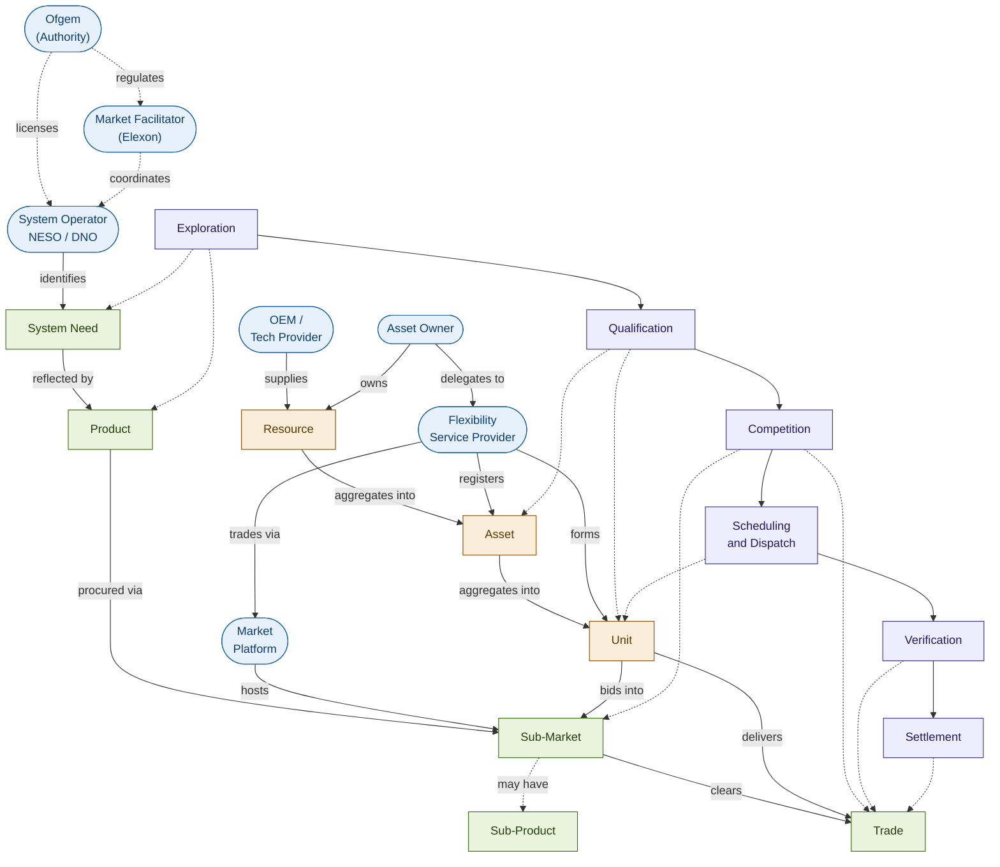
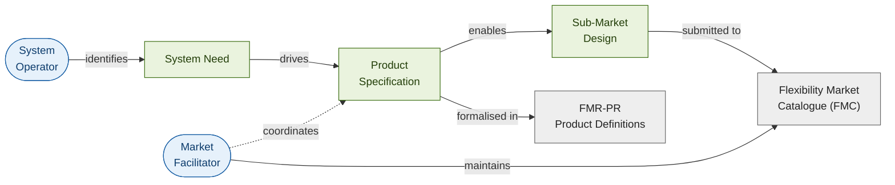
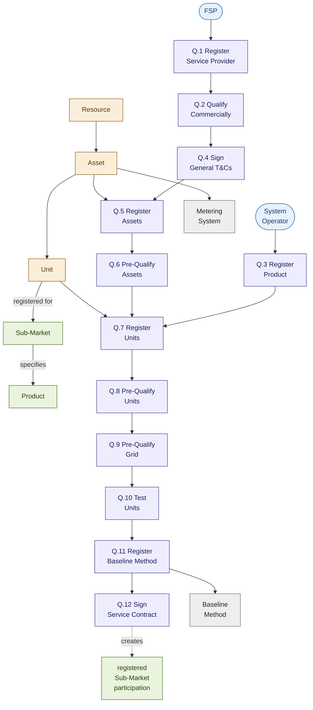
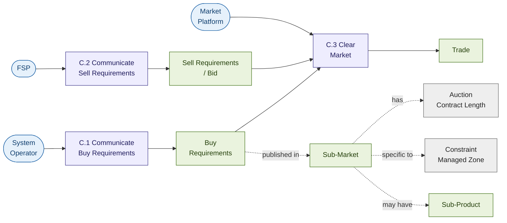
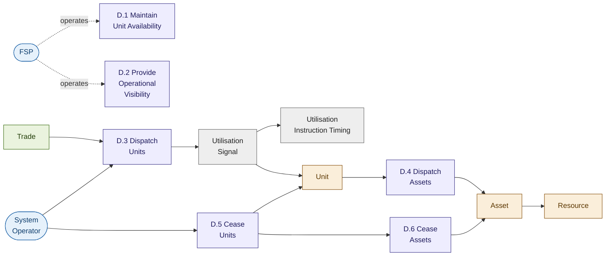
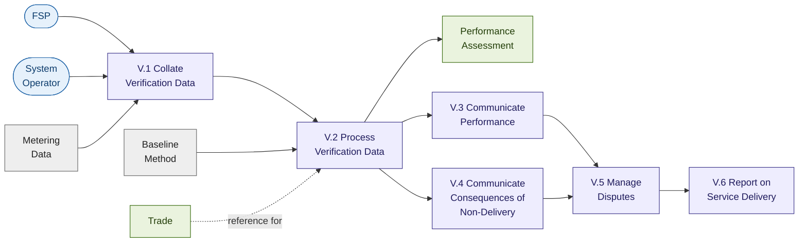
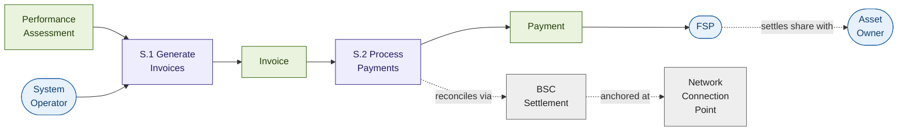
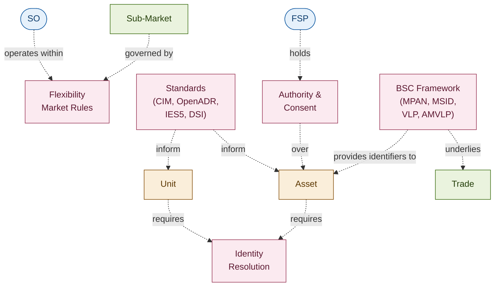

This is the master conceptual map of the GB flexibility market. It exists to **promote shared meaning across the programme**: when a colleague refers to a "Unit" or a "Buy Requirement" or "Q.9 Pre-Qualify Grid", everyone should be able to come here and find the same answer about what that thing is and how it relates to everything else.

The page is structured as:

1. **The orientation map** — the entire flex world on one canvas, at a single level of detail.
2. **Phase-by-phase zooms** — each Market Phase, with the concepts active in that phase and how they interconnect.
3. **A concept index** — every concept on this page, alphabetical, with one-line definitions and links into the full glossary.

Concepts are styled consistently across all diagrams — same colour means same kind of thing — so you can carry meaning between diagrams without having to re-orient.

## Visual conventions

| Style | Meaning |
| --- | --- |
| **Blue rounded** | Actor (party that does things) |
| **Amber square** | Asset-side concept (Resource, Asset, Unit, etc.) |
| **Green square** | Market-side concept (Product, Sub-Market, Trade, etc.) |
| **Purple square** | Process / activity / phase |
| **Grey square** | Reference data or supporting concept |
| **Solid arrow** | Direct relationship (one concept references or contains another) |
| **Dashed arrow** | Indirect or governance relationship |
| **Dotted box** | Phase boundary |

## 1. Orientation map

The flex world on one canvas. Read left to right: actors at the edges, the phase spine across the middle, the asset and market sides above and below.

Things to notice:

- **The spine.** The six Market Phases run across the middle. Every other concept is anchored to one or more phases.
- **The bridges.** Two arrows from Unit cross from the asset side to the market side: _bids into_ and _delivers_. These are the architectural joints between FMAR's natural domain (Asset/Unit registration) and the market mechanics (Sub-Market, Trade, Dispatch).
- **Governance.** Dashed arrows from Ofgem and the Market Facilitator capture that they operate above the day-to-day rather than within it.

## 2. Phase-by-phase zooms

Each phase below shows the concepts that are _active_ in that phase — what gets created, transformed, or consumed during it.

### Exploration

The phase before any market participation. The System Operator and Market Facilitator design what will be procured and how.

**Key concepts active in this phase.** System Need, Product Specification, Sub-Market Design, the [Flexibility Market Catalogue (FMC)](/reference/glossary), the Product Definitions FMR.

**Activities active in this phase (from the E2E catalogue).** E.1 Define Sub-Market, E.2 Understand Flexibility Markets, E.3 Build Investment Case, E.4 Develop Operational Strategy.

**Why this phase matters.** It sets what every later phase will operate on. Choices made here — what counts as a Product, how Sub-Markets are bounded, what parameters they admit — propagate through the entire lifecycle.

---

### Qualification

The phase by which FSPs, Assets, and Units become eligible. The most concept-dense phase in the entire model — twelve standard activities, three asset-side levels, multiple registration artefacts.

**Key concepts active in this phase.** [Resource](/assets/resources), [Asset](/assets/assets), [Unit](/assets/units), Service Provider, Product, Sub-Market, [Metering System](/assets/assets), Baseline Method.

**Activities active in this phase (from the E2E catalogue).** Q.1–Q.12. See [Activity Dependencies](/lifecycle/activity-dependencies) for full definitions.

**Notable points.**

- **Q.3 is upstream and parallel.** Product registration is the System Operator's job and runs alongside the FSP's commercial qualification path. The two converge at Q.7 (Unit Registration) where the FSP's Assets are bound to a specific registered Product.
- **Q.9 timing varies.** Grid pre-qualification can occur pre- or post-Competition depending on the Sub-Market's design. The diagram shows the most common pattern.
- **Q.11 is method, not data.** The Baseline Method is registered here; actual baseline data submission happens later (typically C.2 or D.1).

---

### Competition

The phase in which Trades happen. The smallest activity set (three activities) but the highest-stakes — this is where commercial commitments are formed.

**Key concepts active in this phase.** Sub-Market, Sub-Product, Buy Requirements, Sell Requirements (Bid), Auction Contract Length, Constraint Managed Zone (where applicable), Trade.

**Activities active in this phase (from the E2E catalogue).** C.1 Communicate Buy Requirements, C.2 Communicate Sell Requirements, C.3 Clear Market.

**Notable points.**

- **Sub-Product appears here, not earlier.** Directional symmetry (High/Low, Positive/Negative, Bids/Offers) shows up in the Buy and Sell Requirements — the Sub-Market itself is one Sub-Market, but its requirements are direction-specific.
- **Auction Contract Length is a parameter of the Sub-Market.** It governs how long the resulting Trade lasts.
- **Trade is the output.** Everything from here on operates on Trades.

---

### Scheduling and Dispatch

The phase in which traded flexibility is delivered. Two-level dispatch (Unit then Asset) propagating to physical Resources.

**Key concepts active in this phase.** Trade, Unit, Asset, Resource, Utilisation Signal, Utilisation Instruction Timing.

**Activities active in this phase (from the E2E catalogue).** D.1 Maintain Unit Availability, D.2 Provide Operational Visibility, D.3 Dispatch Units, D.4 Dispatch Assets, D.5 Cease Units, D.6 Cease Assets.

**Notable points.**

- **Dispatch is two-level.** D.3 lands on the Unit; D.4 propagates to the Assets within the Unit. Below the Asset, the FSP's energy management system instructs Resources — generally not modelled at the FMR activity level.
- **Cease is two-level too.** D.5 and D.6 mirror D.3 and D.4. D.5 can occur pre-execution (cancel) or in-execution (early stop).
- **D.1 and D.2 are continuous, not event-driven.** They run alongside dispatch events to maintain availability and visibility.

---

### Verification

The phase in which delivery is assessed against contracted commitments.

**Key concepts active in this phase.** Metering Data, Baseline Method, Performance Assessment, Trade.

**Activities active in this phase (from the E2E catalogue).** V.1–V.6.

**Notable points.**

- **V.3 is direct to FSP.** Performance outcomes go to the relevant Service Provider, not as general disclosure to the wider market. Aggregate market-level reporting sits in V.6.
- **The split at V.2.** Performance and consequences flow on parallel paths from V.2 — both feed into V.5 dispute management.

---

### Settlement

The phase in which money flows. Two activities, but their dependencies on prior phases are deep.

**Key concepts active in this phase.** Performance Assessment, Invoice, Payment, BSC Settlement, Network Connection Point.

**Activities active in this phase (from the E2E catalogue).** S.1 Generate Invoices, S.2 Process Payments.

**Notable points.**

- **The connection point is the settlement anchor.** Although Assets are logical entities, settlement still anchors to the network connection point identified by MPAN/MSID, inherited from BSC settlement. Whether the GB flex model introduces an explicit settlement-boundary entity (analogous to the FIS Accounting Point) is an open design question — see [Reference Models](/reference/reference-models).
- **The FSP–Asset Owner settlement is private.** It happens in commercial space outside the FMR-defined activities.

---

## 3. Cross-cutting concepts

Some concepts don't sit cleanly in one phase — they span the lifecycle and connect things across it.

**Identity Resolution.** How the same Asset, Unit, or FSP is recognised across multiple Sub-Markets and across multiple System Operators. This is one of FMAR's central concerns.

**Authority and Consent.** The contractual stack that establishes who has the right to register, update, or operate any given Asset. Spans the Asset Owner → Agent → FSP → System Operator chain.

**Standards.** CIM, OpenADR, IES5, and DSI inform how Assets and Units are described and addressed. See [Standards](/reference/standards).

**Flexibility Market Rules.** The governing framework — FMR-GLO, FMR-PR, FMR-PQC, the End-to-End Process FMR, and the Governance Documents.

**BSC Framework.** The wholesale Balancing and Settlement Code framework provides foundational identifiers (MPAN, MSID) and actor types (VLP, VTP, AMVLP) that the flexibility market currently inherits.

---

## 4. Concept index

Every concept appearing on this page, in alphabetical order, with one-line orientation. Each entry links to the definition or page that treats it in depth.

| Concept | One-line | Where to read more |
| --- | --- | --- |
| **Asset** | Logical bundle of one or more Resources at a single network connection point, paired with a Metering System. | [Assets](/assets/assets) |
| **Asset Owner** | Legal owner of a Resource / Asset. | [Asset Chain](/actors/asset-chain) |
| **Auction Contract Length** | The duration parameter of a Sub-Market — governs how long resulting Trades last. | [Sub-Markets](/mechanics/sub-markets) |
| **Authority** | Ofgem (Gas and Electricity Markets Authority). | [Glossary](/reference/glossary) |
| **Baseline Method** | The agreed counterfactual for measuring delivered flexibility. | [Verification and Settlement](/mechanics/verification-and-settlement) |
| **BSC Framework** | The Balancing and Settlement Code framework providing identifiers and wholesale-side actor types. | [Standards](/reference/standards) |
| **Buy Requirements** | The System Operator's published need within a Competition. | [Competition and Clearing](/mechanics/competition-and-clearing) |
| **Constraint Managed Zone (CMZ)** | A geographic area within which flexibility is required to manage a network constraint. | [Glossary](/reference/glossary) |
| **DNO (Distribution Network Operator)** | Holder of a Distribution Licence; operates a regional distribution network. Excludes IDNOs. | [System Operators](/actors/system-operators) |
| **Exploration** | The Market Phase where needs are identified and Sub-Markets/Products are designed. | [Phases](/lifecycle/phases) |
| **Flexibility Market Catalogue (FMC)** | The catalogue of relevant parameters submitted by SOs and maintained by the MF. | [Glossary](/reference/glossary) |
| **Flexibility Market Rules (FMRs)** | The set of rules governing the flexibility market, owned by the Market Facilitator. | [Glossary](/reference/glossary) |
| **FSP (Flexibility Service Provider)** | Any party providing Flexibility Services. The contracting party with the System Operator. | [Service Providers](/actors/service-providers) |
| **Invoice** | The financial output of S.1, reflecting verified delivery. | [Verification and Settlement](/mechanics/verification-and-settlement) |
| **Market Activity** | A discrete operational step contributing to a market process. Can occur in parallel or sequentially. | [Activity Dependencies](/lifecycle/activity-dependencies) |
| **Market Facilitator** | The MF role performed by Elexon under the Authority's designation. | [Platforms and Facilitator](/actors/platforms-and-facilitator) |
| **Market Phase** | A logical grouping of Market Activities sharing a common objective and temporal alignment. | [Phases](/lifecycle/phases) |
| **Market Platform** | A digital platform hosting the matching of Buy and Sell Requirements. | [Platforms and Facilitator](/actors/platforms-and-facilitator) |
| **Metering System** | The approved measurement system pairing a Resource with the market. | [Assets](/assets/assets) |
| **NESO** | National Energy System Operator Limited. | [System Operators](/actors/system-operators) |
| **Network Connection Point** | The settlement anchor (MPAN / MSID), inherited from BSC. | [Verification and Settlement](/mechanics/verification-and-settlement) |
| **Ofgem** | The Authority — GB energy regulator. | [Regulator](/actors/regulator) |
| **Payment** | The financial transfer to the FSP after S.2. | [Verification and Settlement](/mechanics/verification-and-settlement) |
| **Performance Assessment** | The output of V.2 — calculated delivered flexibility against contracted commitment. | [Verification and Settlement](/mechanics/verification-and-settlement) |
| **Pre-Qualify** | An ex-ante check that a participant, Asset, or Unit meets minimum requirements. | [Glossary](/reference/glossary) |
| **Product** | A defined flexibility service procured by a System Operator. Five FMR-named Products: OU, PR, SAOU, SU, VAOU. | [Needs and Products](/mechanics/needs-and-products) |
| **Qualification** | Both a state (eligible to participate) and a Market Phase (the activities leading to that state). | [Glossary](/reference/glossary) |
| **Resource** | The physical hardware that generates, consumes, or stores electricity. | [Resources](/assets/resources) |
| **Service Provider** | See FSP. | [Service Providers](/actors/service-providers) |
| **Settlement** | The Market Phase in which money flows. | [Phases](/lifecycle/phases) |
| **Sub-Market** | Specific segment of the Flexibility Market: one System Operator, one Product, specific time period. | [Sub-Markets](/mechanics/sub-markets) |
| **Sub-Product** | Directional/symmetric variant of a Product within the same Sub-Market (e.g. High/Low). | [Sub-Markets](/mechanics/sub-markets) |
| **System Need** | The operational requirement that a Product is intended to address. | [Needs and Products](/mechanics/needs-and-products) |
| **System Operator** | NESO or a DNO — the parties responsible for the operation and coordination of electricity systems. | [System Operators](/actors/system-operators) |
| **Trade** | A matched buy and sell — the contractual outcome of C.3 Clear Market. | [Competition and Clearing](/mechanics/competition-and-clearing) |
| **Unit** | A generalisation of NESO Auction Unit and DNO Asset Group; what gets bid into a Sub-Market. | [Units](/assets/units) |
| **Utilisation Signal** | The instruction that initiates delivery of utilisation by a Unit. | [Dispatch](/mechanics/dispatch) |
| **Utilisation Instruction Timing** | The timing parameters of the Utilisation Signal. | [Dispatch](/mechanics/dispatch) |
| **Verification** | The Market Phase in which delivery is assessed. | [Phases](/lifecycle/phases) |

---

## How to use this page

**As a glossary lookup with context.** When you hear a term and want to know what it is _and how it relates to other things_, this page shows both. The Concept Index gives you the term; the diagrams show its neighbours.

**As an onboarding tool.** A new joiner can scan the orientation map in 30 seconds and understand the shape of the world, then read each phase zoom in 2–3 minutes for depth. Total orientation time: ~20 minutes for the whole flex world.

**As a working reference in design conversations.** When two colleagues are talking past each other ("Unit" — do you mean the FMR Unit or the FIS CU?), pointing at this page resolves it in seconds.

**As a change-tracking surface.** When the FMRs evolve, this page is the canonical place to update — and the visual nature makes the change visible at a glance.

## Maintaining this page

Three rules for keeping it living rather than rotting:

1. **Update it when terminology changes.** Whenever FMR-GLO is revised, this page should be updated within the same change cycle.
2. **Add new concepts with discipline.** New concepts go in the appropriate phase zoom _and_ the Concept Index. Don't add to one without the other.
3. **Resist sprawl.** If a concept needs more than two sentences in the index, give it a dedicated page elsewhere on the site and link from here. The point of this page is connectivity, not depth.

A named owner — currently the SME on this programme — should review this page on a fixed cadence (suggested: monthly). The change log on the [introduction page](/introduction) records material updates.

## Related pages

- [Glossary](/reference/glossary) — formal definitions for every concept on this page.
- [Reference Models](/reference/reference-models) — how concepts here map to international references like FIS / EuroFlex.
- [Sub-Market Catalogue](/reference/sub-market-catalogue) — the live list of Sub-Markets in operation.
- [Activity Dependencies](/lifecycle/activity-dependencies) — the full Market Activity catalogue.