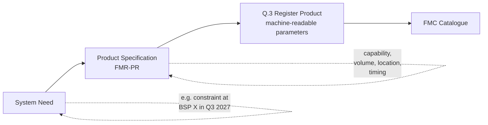

A flexibility Product begins life as a System Need — an operational requirement the System Operator has — and becomes a procurable service through the Product Definitions Flexibility Market Rule.

## From need to Product

A **System Need** is a specific operational requirement: managing a network constraint, providing reserve capacity, responding to a frequency event. Needs are identified through:

- Network analysis to identify where additional flexibility could defer or replace traditional reinforcement.
- Operational experience surfacing recurring constraints or imbalance positions.
- Strategic outlook as the energy mix evolves.

A **Product Specification** turns the need into a defined service governed by the **Product Definitions Flexibility Market Rule (FMR-PR)**. It specifies what an Asset/Unit must be able to do, when, where, and how performance will be measured.

## What a Product specification contains

A typical Product specification includes:

- **Service capability.** What the Unit must do — turn down, turn up, hold a state, ramp at a specified rate.
- **Volume.** How much capacity is being procured.
- **Locational requirements.** Where the Unit must be electrically located (e.g. a CMZ for DNO Products, a zone or GB-wide for NESO Products).
- **Temporal requirements.** When the service must be available.
- **Response characteristics.** How fast the Unit must respond, how long it must hold, how it returns to baseline.
- **Technical constraints.** Metering requirements, telemetry requirements, available baseline method options.
- **Commercial terms.** Pricing structure (availability, utilisation, or both), contract duration options.
- **Penalties.** Consequences of non-delivery.

## Products formally defined in the Market Facilitator Glossary

Five Products are currently named as defined terms in FMR-GLO, with their full specifications in the Product Definitions FMR:

| Product | Code | Source |
| --- | --- | --- |
| Operational Utilisation | OU | FMR-PR |
| Peak Reduction | PR | FMR-PR |
| Scheduled Availability \+ Operational Utilisation | SAOU | FMR-PR |
| Scheduled Utilisation | SU | FMR-PR |
| Variable Availability \+ Operational Utilisation | VAOU | FMR-PR |

These are the Products around which most current DNO Sub-Markets are organised. Each can be procured through multiple Sub-Markets — different DNOs procure the same Product in their own Sub-Markets, with different time periods and license areas.

## Other Products in operation

In addition to the Products formally named in FMR-GLO, several other Products are in active operation across the GB flexibility market — primarily NESO ancillary services. These have their own specifications under NESO Service Terms rather than FMR-PR:

**NESO Response products.** Static FFR, Dynamic Containment (with High and Low Sub-Products), Dynamic Moderation (High and Low), Dynamic Regulation (High and Low).

**NESO Reserve products.** STOR, Fast Reserve, Quick Reserve (Positive and Negative Sub-Products), Slow Reserve (Positive and Negative), Balancing Reserve (Positive and Negative).

**NESO Constraint Management.** Local Constraint Market, MW Dispatch, DFS, Constraint Management Pathfinders.

**Other NESO services not in current MF scope.** Obligatory Reactive Power Service, Voltage Network Services Procurement, Stability Markets.

**The Balancing Mechanism.** Operated by NESO; Bids and Offers are Sub-Products in the same Sub-Market.

The full list of Sub-Markets and their Products is at [Sub-Market Catalogue](/reference/sub-market-catalogue).

## Sub-Products

A Sub-Product is a directional or symmetric variant of a Product within the same Sub-Market. The most common pattern is directional symmetry:

- **High vs. Low** — turn-down vs. turn-up frequency response variants of Dynamic Containment, Dynamic Moderation, Dynamic Regulation.
- **Positive vs. Negative** — directional reserve variants of Quick Reserve, Slow Reserve, Balancing Reserve.
- **Bids vs. Offers** — directional variants in the Balancing Mechanism.

Sub-Products live within a single Sub-Market — they share the System Operator, the time period, and (in most cases) the underlying Product specification. They differ in direction, and consequently in the Buy Requirements, Sell Requirements, and clearing.

Sub-Product is not currently a defined term in FMR-GLO. It's used operationally and reflected in the Sub-Markets in scope catalogue.

## How Products relate to Sub-Markets

In current practice, Sub-Markets are organised around Products in a roughly 1:1 way — each combination of System Operator, Product, and time period is its own Sub-Market. This is partly historical (each operator developed its own procurement vehicles independently) and partly reflects the FMR-GLO definition of a Sub-Market as procuring "a specific product within a specific time period."

The Market Facilitator's coordination work explicitly aims to rationalise this landscape over time. Whether the 1:1 mapping persists is one of the open design questions.

## Related pages

- [Sub-Markets](/mechanics/sub-markets) — the procurement vehicles within which Products are bought.
- [Sub-Market Catalogue](/reference/sub-market-catalogue) — the full current list.
- [Glossary](/reference/glossary) — formal definitions of OU, PR, SAOU, SU, VAOU.