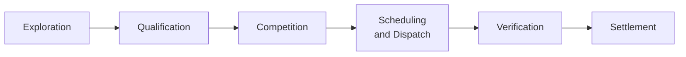

The flexibility market lifecycle is described in the End-to-End Process Flexibility Market Rule as a set of **Market Activities** organised into **Market Phases**. Six phases are recognised in the working model.

A note before the diagram: the End-to-End Process FMR explicitly recognises that **Market Activity can occur in parallel or sequentially to one another**. The phases are organising frames, not strict sequence numbers — Q.9 Pre-Qualify Grid can occur pre- or post-Competition; Verification activities can run in parallel branches; the same activity can occur differently in different Sub-Markets.

## The six phases

| Phase | Purpose | Time horizon |
| --- | --- | --- |
| **Exploration** | Identify needs; design Products and Sub-Markets | Months to years |
| **Qualification** | Register and pre-qualify FSPs, Assets, Units | Weeks to months |
| **Competition** | Buy/sell signalling and clearing | Hours to months |
| **Scheduling and Dispatch** | Operational delivery | Real-time |
| **Verification** | Performance assessment | Days to weeks |
| **Settlement** | Invoicing and payment | Weeks |

The phases overlap in calendar time. While one trade is being settled, another is being dispatched, a third is being cleared, and a fourth's Product is still being explored.

## Sub-pages

<CardGroup cols={2}>
  <Card title="Phases" href="/lifecycle/phases">
    Detail on each of the six Market Phases — the activities, primary actors, and deliverables.
  </Card>

  <Card title="Activity Dependencies" href="/lifecycle/activity-dependencies">
    The 29 standard Market Activities defined in the End-to-End Process FMR and how they connect.
  </Card>

  <Card title="Sub-Market Variation" href="/lifecycle/sub-market-variation">
    How phases and activity selection vary across Sub-Markets, and where the meaningful variation actually sits.
  </Card>
</CardGroup>

## Why the lifecycle view matters

The lifecycle view complements the [Mechanics](/mechanics/overview) view. Mechanics asks "what is the chain of buying and selling?"; lifecycle asks "what does an Asset/Unit go through?". Both views describe the same reality from different angles.

The lifecycle view is particularly useful for:

- **Onboarding.** Understanding what an FSP needs to do to bring a new Asset into a Sub-Market.
- **Programme planning.** Knowing where in the lifecycle a proposed change has its impact.
- **Cross-Sub-Market analysis.** Identifying where activities are similar or different across Sub-Markets.
- **Coordination work.** Programmes like FMAR specifically target lifecycle stages where coordination has the most leverage.

## Related pages

- [Market Mechanics](/mechanics/overview) — the same activity from the market's perspective.
- [Registration and Qualification](/assets/registration-and-qualification) — the Qualification phase in operational detail.
- [Glossary](/reference/glossary) — formal definitions of Market Phase, Market Activity, Qualification, Pre-Qualify.