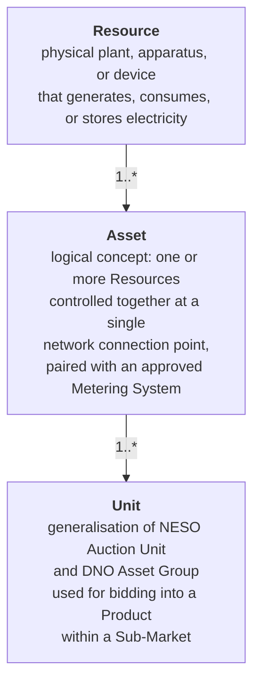
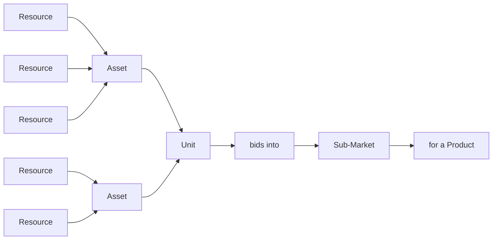

In the GB flexibility market, "asset" has a precise meaning. The End-to-End Process Flexibility Market Rule defines a three-level hierarchy — **Resource → Asset → Unit** — that anchors how flexibility is registered, controlled, and traded.

## The three levels

These definitions come from the End-to-End Process FMR (see [Glossary](/reference/glossary)). They are deliberately abstract — _Asset_ is a logical concept, not a physical thing — because they need to cover everything from a single domestic battery to a 10,000-strong heat pump portfolio.

## Walking up the hierarchy

**Resource.** The actual hardware. A battery, an inverter, a heat pump, an EV charger, a controllable industrial process. Resources are the bottom of the stack — they're what physically does the work. A Resource by itself isn't yet visible to the flexibility market. It must be paired by an FSP with an approved Metering System to become part of a registered Asset.

**Asset.** A logical bundle of one or more Resources at a single network connection point, with the metering, control, and energy management infrastructure that lets them act together. An Asset is what the FSP commercially registers; it is the entity the FMRs primarily refer to. The "single network connection point" requirement means co-located equipment behind one connection naturally maps to one Asset, but a portfolio of equipment at different locations is many Assets.

**Unit.** What gets bid into a Sub-Market. A Unit may contain a single Asset or aggregate multiple Assets together (the DNO "Asset Group" pattern), depending on what the Sub-Market and Product require. The same Asset can be part of different Units in different Sub-Markets — the Unit is a market-facing construct, not a physical one.

## Why three levels rather than one

Each level exists for a distinct reason:

- **Resource** captures the physical reality — what equipment is actually present and what it can do.
- **Asset** captures the operational reality — what's commercially registered, controlled, and metered as a coherent unit.
- **Unit** captures the market reality — what's offered to a specific Sub-Market for a specific Product.

These levels don't always change together. A firmware update to a Resource doesn't change the Asset's commercial registration. Adding a new Sub-Market to your participation creates a new Unit, but the underlying Asset is unchanged. Switching FSP changes the registration of an Asset, but the Resources behind it carry on as before.

## What sits behind a Sub-Market participation

A more complete picture of how the levels connect to the market:

Resources aggregate into Assets. Assets aggregate into Units. Units bid into Sub-Markets. Each Sub-Market procures a specific Product on behalf of a specific System Operator (see [Sub-Markets](/mechanics/sub-markets)).

## Sub-pages

<CardGroup cols={2}>
  <Card title="Resources" href="/assets/resources">
    The physical layer — what counts as a Resource and what's required to make one part of a registered Asset.
  </Card>

  <Card title="Assets" href="/assets/assets">
    The logical/operational layer — how Assets are registered, what the "single connection point" rule means in practice.
  </Card>

  <Card title="Units" href="/assets/units">
    The market-facing layer — how Units are formed, including aggregation patterns across NESO and DNOs.
  </Card>

  <Card title="Registration and Qualification" href="/assets/registration-and-qualification">
    The operational process by which the three levels become market-eligible.
  </Card>
</CardGroup>

## A note on terminology

The Resource → Asset → Unit hierarchy is the **GB-specific** vocabulary established under the FMRs. The same architectural levels appear under different names in international reference models — most notably the Norwegian FIS / EuroFlex hierarchy of TR → CU → SPG → AP. The mappings are close but not identical, and FMAR data model work continues to refine the boundaries. See [Reference Models](/reference/reference-models) for the cross-walk.

## Related pages

- [Glossary](/reference/glossary) — formal definitions of Resource, Asset, and Unit.
- [Sub-Markets](/mechanics/sub-markets) — what Units bid into.
- [Lifecycle](/lifecycle/overview) — what happens to assets across phases.