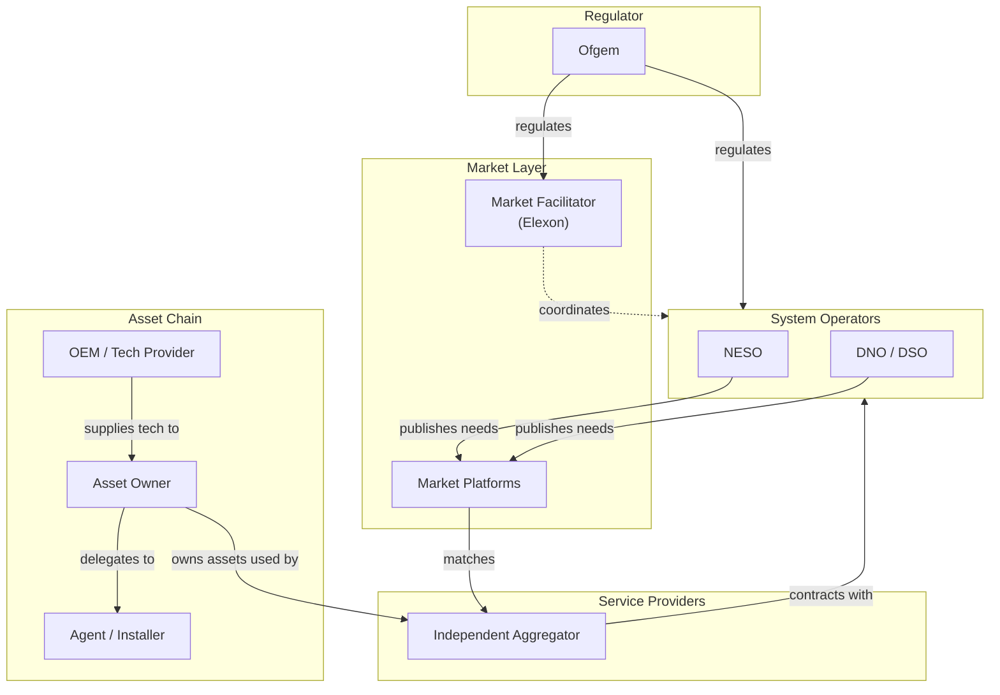

The GB flexibility market involves a set of distinct parties, with a plethora of defined roles according to the market and regulatory landscape. 

A **Role** designates a context-specific, time-bound set of responsibilities with regards to a **Mechanic**.

Understanding who does what is the foundation for understanding how anything else works.

## The Actor landscape

## The Role Landscape

## Five groupings

The actors group naturally into five categories based on the kind of work they do:

<CardGroup cols={2}>
  <Card title="System Operators" href="/actors/system-operators">
    NESO and DNOs — the parties that need flexibility to keep the system running and procure it from the market.
  </Card>

  <Card title="Service Providers" href="/actors/service-providers">
    FSPs — the parties that contract to deliver flexibility, owning the commercial relationship with asset owners.
  </Card>

  <Card title="Asset Chain" href="/actors/asset-chain">
    Asset owners, agents, installers, and OEMs — the parties behind the physical equipment that delivers flexibility.
  </Card>

  <Card title="Platforms and Facilitator" href="/actors/platforms-and-facilitator">
    Market platforms and the Market Facilitator — the infrastructure layer that makes transactions possible.
  </Card>
</CardGroup>

The fifth grouping is the [Regulator](/actors/regulator), which sits above all of these and sets the rules within which they operate.

## Why the groupings matter

The grouping isn't merely organisational. Different groups carry different kinds of risk and have different governance:

- **System operators** carry network and consumer risk; they answer to Ofgem.
- **Service providers** carry commercial and delivery risk; they answer to system operators contractually.
- **Asset chain actors** carry physical and consent risk; they answer to consumers and asset owners directly.
- **Platform layer actors** carry coordination and data integrity risk; their authority comes from the market codes they operate under.

The boundaries between these groups are where most of the interesting design questions in the market live.