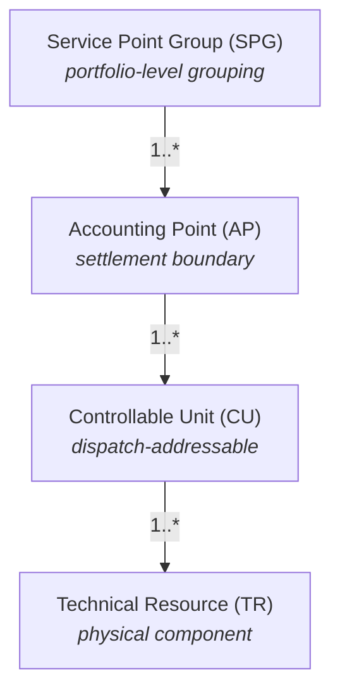

The GB flexibility market is being designed in dialogue with international reference models. This page captures the most relevant reference and how its concepts map onto the GB FMR vocabulary.

## FIS / EuroFlex (Norway)

The **Flexibility Information System (FIS)**, developed in Norway and aligned with the EuroFlex framework, is the most mature operational reference for flexibility data modelling internationally. It defines a four-level hierarchy that covers similar architectural ground to the GB FMR Resource → Asset → Unit hierarchy, but with different naming and slightly different boundaries.

### The FIS hierarchy

### Mapping to GB FMR vocabulary

The mapping to the FMR vocabulary used in GB is close in meaning, but the names and boundaries differ. The current working alignment is:

| FIS term | GB FMR term | Notes |
| --- | --- | --- |
| **Technical Resource (TR)** | **Resource** | Physical hardware that generates, consumes, or stores electricity. Direct match. |
| **Controllable Unit (CU)** | **Asset** | The dispatch-addressable, controllable unit of flexibility. The FMR Asset is the logical bundle of Resources at one connection point — close to FIS's CU. |
| **Service Point Group (SPG)** | **Unit** | The aggregation level for market participation. In FIS this is portfolio-flavoured; in FMR the Unit can contain a single Asset or many. |
| **Accounting Point (AP)** | (no direct equivalent in FMR Asset model) | The settlement boundary. In GB, settlement is anchored by MPAN/MSID at the network connection point, inherited from BSC settlement rather than modelled as a flex-market entity. |

The Accounting Point gap is structurally meaningful. In FIS, the AP is an explicit modelled level between portfolio and dispatch unit; in current GB practice, the equivalent settlement boundary is implicit in the connection point identifier (MPAN). Whether this changes — whether GB introduces an explicit AP-equivalent into the FMR data model — is one of the design questions FMAR is actively working through.

### Why FIS matters for GB

Several reasons the FIS reference is referred to in GB design conversations:

- **Operational maturity.** FIS is in production use and has surfaced design issues that GB can learn from rather than re-encounter.
- **International interoperability.** Where GB diverges from FIS, the divergence ought to be deliberate — and where it can converge, that supports cross-border flex market alignment over time.
- **Terminology discipline.** FIS provides a worked example of consistent naming across hierarchy levels, which is a discipline GB is still developing.

The FMAR programme's data modelling work explicitly cross-references FIS as a benchmark.

## Other reference frameworks

A short list of other frameworks that inform aspects of GB flexibility design:

**CIM (Common Information Model)** — IEC 61970 / 61968. International standard for power system information exchange. Influential for network-side modelling, less directly for flexibility-market modelling. See [Standards](/reference/standards).

**IEC 62325** — market communications standard family. Relevant for some flexibility market message structures, particularly where they touch wholesale market processes.

**IEC 62746-4** — defines messages for market based communications between grid operators, aggregators and customer energy management systems. How the references will evolve

**OpenADR** — international standard for issuing dispatch signals to flexible loads. Operational standard rather than a modelling reference, but informs the dispatch-side data structures. A GB profile of OpenADR is currently under development via MF and ENA. See [Standards](https://elexon-a1ed7108.mintlify.app/reference/standards).

The FMAR programme is working towards a GB-specific data model that aligns with international precedent where useful and diverges where GB's market structure requires it. Expected directions:

- **Tighter cross-walk to FIS.** The Resource → Asset → Unit alignment is likely to become more explicit, with documented mappings.
- **Treatment of the settlement boundary.** Whether the GB model introduces an AP-equivalent (or some other explicit settlement-boundary entity) is being worked through.
- **CIM alignment for network-facing data.** Where FMAR data needs to interoperate with network operators' own CIM-based systems, alignment work is ongoing.

This page will be updated as those design directions firm up.

## Related pages

- [Assets: Overview](/assets/overview) — the GB FMR Resource → Asset → Unit hierarchy.
- [Standards](/reference/standards) — relevant technical standards.
- [Glossary](/reference/glossary) — formal definitions of GB FMR terms.