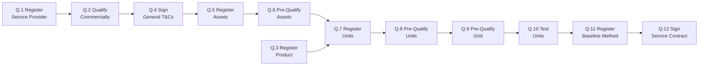

Before any flexibility can be sold, a sequence of registration and qualification activities must happen. The End-to-End Process FMR defines twelve standard Qualification activities (Q.1 to Q.12), each with a specific scope.

A note before starting: the End-to-End Process FMR explicitly recognises that "Market Activity can occur in parallel or sequentially." The diagram and ordering below reflect a representative dependency pattern, but specific Sub-Markets exhibit variations.

## The standard sequence

Each box is a defined Market Activity with its own inputs, outputs, and responsible actors. The full activity definitions are maintained in the End-to-End Process FMR.

## Service Provider qualification

**Q.1 Register Service Provider.** The FSP submits commercial information to become a recognised Service Provider for a Product within a Sub-Market — user and company information, plus wider commercial criteria as defined in FMR-PQC (the Pre-Qualification Criteria FMR).

**Q.2 Qualify Commercially.** The System Operator confirms the FSP's commercial criteria — credit, corporate compliance, insurance details — match the obligations.

**Q.4 Sign General T&Cs.** The FSP signs a framework agreement establishing the common legal and commercial relationship with the System Operator. This is distinct from the per-service contract in Q.12.

## Product registration (System Operator side)

**Q.3 Register Product.** The System Operator publishes Product parameters in a machine-readable format (e.g., the structured Product Definition parameters in FMR-PR, or NESO Service Parameters).

This is **not** the same as Sub-Market design or Buy Requirement publication:

- _Sub-Market design_ happens in the Exploration phase.
- _Q.3 Register Product_ is the machine-readable publication of the Product's parameters.
- _C.1 Communicate Buy Requirements_ is the publication of specific procurement needs in the Competition phase.

The distinction matters because each step has different consumers and different governance. Q.3 establishes the Product machine-readably so that downstream activities (registration, bidding) can reference it consistently.

## Asset registration

**Q.5 Register Assets.** The FSP submits technical information about the Asset required for participation in the Sub-Market — including the technical qualification parameters defined in FMR-PQC and any additional NESO Eligible Asset requirements.

**Q.6 Pre-Qualify Assets.** The System Operator validates that the Asset's technical information meets the Sub-Market's obligations.

After Q.6, the Asset is pre-qualified — it has cleared the Asset-level checks but still needs to be incorporated into a registered Unit before it can participate.

## Unit registration

**Q.7 Register Units.** The FSP provides additional technical information about a Unit, including the allocation of Assets to that Unit. This is the activity where aggregation decisions are made — a Unit may contain a single Asset or several.

**Q.8 Pre-Qualify Units.** The System Operator verifies the Unit's technical information, logical control arrangements, and grid connectivity meet the requirements for delivering the Product (per NESO Service Terms or DNO equivalents).

## Grid validation

**Q.9 Pre-Qualify Grid.** The System Operator verifies that the relevant network segment(s) can handle a Unit providing the Product — typically through a grid impact assessment.

A specific clarification on Q.9: it can occur at different points relative to other activities, depending on the Sub-Market's design:

- **Pre-competition.** Before bids are submitted (Unit must be grid-pre-qualified to bid).
- **Post-competition, pre-dispatch.** After contracts are awarded but before delivery.
- **Post-scheduling.** During the run-up to or during delivery, where grid conditions are dynamic.

This is a clear example of the "activities can occur in parallel or sequentially" caveat — Q.9's positioning materially affects how the Sub-Market operates.

## Operational readiness

**Q.10 Test Units.** The FSP and System Operator conduct an operational trial — typically a communication test or dispatch test — to confirm the Unit is ready ahead of actual service delivery.

**Q.11 Register Baseline Method.** The FSP submits the chosen baseline method (per the applicable baselining methodology) for use in performance assessment.

A clarification on Q.11: this activity registers the **method**, not actual baseline data. Submission of baseline _data_ happens in later phases — for example, in C.2 Communicate Sell Requirements (where Final Physical Notifications for Reserve services are submitted) or in D.1 Maintain Unit Availability (for products using a baseline-kW dispatch API endpoint).

## Service contracting

**Q.12 Sign Service Contract.** The FSP signs the per-service contract setting out the detailed service requirements, operational arrangements, and payment basis. This is distinct from the framework T&Cs in Q.4 — Q.4 establishes the relationship; Q.12 binds the specific service.

The Q.4 / Q.12 split was introduced to clarify the difference between framework agreements and specific service obligations. Earlier versions of the activity model collapsed these into one step, which made it harder to handle scenarios like an FSP changing services without renegotiating the framework.

## Variation across Sub-Markets

Not all twelve activities are used in every Sub-Market. Common variation:

- **Q.3 vs. Q.7 dependency.** Where a Product is well-established, Q.3 may be a one-off and Q.7 (Unit registration) refers to the existing Product registration. Where the Sub-Market is being newly defined, the Q.3 → Q.7 dependency is freshly exercised.
- **Q.9 timing.** As described above, this varies by Sub-Market design.
- **Q.10 testing intensity.** Some Sub-Markets require formal physical testing; others accept telemetry-based confirmation.
- **Q.11 baseline method options.** Different Products allow different baseline method registrations.
- **Q.12 service contract.** Used where a per-service contract is required on top of the framework T&Cs; not all Sub-Markets need this.

The Flexibility Market Catalogue (FMC) submission for each Sub-Market documents which activities apply and their specific configurations.

## Variation across System Operators

Beyond Sub-Market variation, the same activity is implemented differently across System Operators:

- **Q.1 platforms.** NESO uses the Single Markets Platform; DNOs use a mix including Market Gateway, Piclo Flex, Electron Connect, Epex Spot.
- **Q.2 commercial requirements.** Vary by operator.
- **Q.10 testing protocols.** Vary by operator and by Product.

Reducing this between-operator variation is one of the central drivers of the Market Facilitator's coordination work and FMAR specifically.

## Related pages

- [Assets](/assets/assets) — what's being registered at Q.5/Q.6.
- [Units](/assets/units) — what's being registered at Q.7/Q.8.
- [Activity Dependencies](/lifecycle/activity-dependencies) — the full activity dependency graph including Competition, Dispatch, Verification, and Settlement.
- [Lifecycle Phases](/lifecycle/phases) — the broader phase structure.