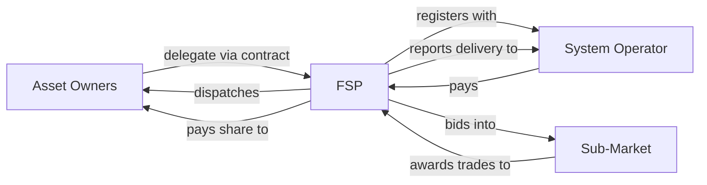

A **Flexibility Service Provider** is defined in the Market Facilitator Glossary (FMR-GLO) as:

> _Any person providing Flexibility Services._

The End-to-End Process FMR adds context, describing FSP as "an umbrella term for the party who takes delivery and other contractual risks when providing Flexibility Services."

The FSP is the contracting party with the System Operator. The FSP holds responsibility for delivering against that contract — even when the underlying flexibility comes from Resources, Assets, or Asset Owners that are different legal entities.

## What FSPs do

Specifically, an FSP:

- **Aggregates Assets.** Builds a portfolio from one or many Asset Owners.
- **Registers and qualifies.** Submits Asset and Unit data through the Qualification activities (Q.1 to Q.12).
- **Bids into Sub-Markets.** Responds to Buy Requirements published by System Operators.
- **Manages dispatch.** Translates Trade outcomes into instructions to Units, Assets, and Resources.
- **Reports delivery.** Submits metering and baseline data for Verification.
- **Settles commercially.** Receives payment from System Operators (S.1 / S.2) and passes a contracted share back to Asset Owners.

## Types of FSP

The FSP role is technology- and ownership-neutral. In practice, FSPs fall into a few common patterns:

- **Independent aggregators.** Specialist companies whose entire business is aggregating third-party flexibility.
- **Vertically integrated retailers.** Large suppliers that aggregate their own customers' flexibility.
- **Asset owner FSPs.** Industrial sites or large commercial operators registering their own Assets directly.
- **OEM-led aggregators.** Equipment manufacturers (notably in EVs and heat pumps) that provide aggregation as a service to customers buying their hardware.

## Related BSC actor types

In NESO Sub-Markets — particularly the Balancing Mechanism — additional BSC-derived actor types are commonly referenced:

| Type | Role |
| --- | --- |
| **Virtual Lead Party (VLP)** | Aggregator role within the BSC framework, allowing aggregation of demand-side flexibility into the Balancing Mechanism. |
| **Virtual Trading Party (VTP)** | A counterparty in the wholesale market who can trade without an underlying physical position. |
| **Asset Metered Virtual Lead Party (AMVLP)** | A VLP using asset-level metering arrangements. |
| **Supplier** | Licensed electricity supplier. May participate as an FSP using its customer base's flexibility. |
| **Generator** | A licensed generator participating in flexibility markets. |
| **CM Provider** | A party with a Capacity Market obligation. Capacity Market itself is out of MF scope. |

These are not all defined in FMR-GLO — they come from the BSC framework that NESO Sub-Markets interface with. They appear here because real FSPs often hold one or more of these BSC actor types alongside their flex-market role.

## Why FSPs matter to market design

The FSP layer is where the market's headline promise — that any flexible asset, however small, can participate — becomes operationally real. Without aggregators, individual domestic Resources would be too small and too unreliable to transact with System Operators directly.

This is also why FSP-related questions tend to be politically charged in market design:

- **Switching.** Can an Asset Owner change FSP without losing market position?
- **Value-stacking.** Can the same Asset, via the same FSP, deliver to multiple Sub-Markets simultaneously?
- **Disintermediation.** Should Asset Owners be able to bypass FSPs and contract directly?

Each question has implications for who captures the economic value of flexibility.

## Related pages

- [Asset Chain](/actors/asset-chain) — Asset Owners, Agents, OEMs whose flexibility FSPs aggregate.
- [Assets](/assets/assets) — what FSPs register.
- [Units](/assets/units) — what FSPs bid into Sub-Markets.
- [Glossary](/reference/glossary) — formal definitions of FSP, Service Provider, Flexibility Service.