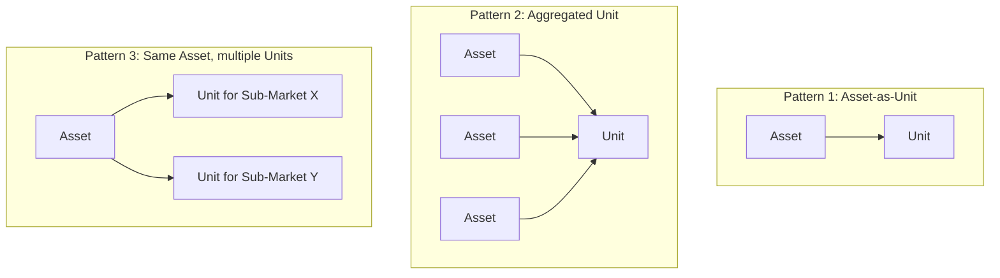

A **Unit** is what gets bid into a Sub-Market. The End-to-End Process FMR defines it as:

> _A generalisation of Auction Unit (NESO) which may contain a single Asset or an Asset Group (DNO) to be used for a product procured via / delivered in a Sub-Market._

The Unit is the market-facing entity. A Unit doesn't exist in the abstract — it exists because it's been formed for participation in a specific Sub-Market for a specific Product.

## A generalisation across NESO and DNO terms

Two pre-existing terms inform the Unit definition:

- **Auction Unit** is the NESO term — used in NESO Service Terms for ancillary services and the Balancing Mechanism. It is the entity at which NESO addresses bids and dispatch.
- **Asset Group** is the DNO term — used by DNOs to describe how Assets can be bundled for participation in DNO Sub-Markets, often allowing FSPs to combine smaller Assets into a market-meaningful aggregate.

Unit covers both. This is not a renaming of either — it's an umbrella concept that lets the FMRs describe market participation in a way that doesn't depend on which System Operator is involved.

## What does a Unit contain?

A Unit may be:

- **A single Asset.** Common when the Asset is large enough to participate on its own — a 50 MW battery, a major industrial site.
- **Multiple Assets bundled together.** Common when:
  - Aggregating smaller Assets to meet minimum bid sizes.
  - Combining Assets to deliver a Product that requires a specific volume profile.
  - Operating across a portfolio for risk management.

The aggregation is governed by the Sub-Market's rules — what counts as a valid Unit varies. Some Sub-Markets allow geographically diverse aggregation; others require all bundled Assets to share locational characteristics (e.g. same Constraint Managed Zone).

The third pattern matters in particular: an Asset can participate in multiple Sub-Markets concurrently, with a separate Unit for each. This is one of the operational realities behind value-stacking discussions.

## What gets registered for a Unit

Unit registration captures:

- The **constituent Asset(s)**.
- The **Sub-Market** the Unit is registered for.
- The **Product** (and Sub-Product variant, where applicable) the Unit will bid for.
- The **bid characteristics** — how the Unit will offer capacity, energy, and pricing.
- The **dispatch arrangement** — how dispatch instructions land on the Unit and propagate to the underlying Assets and Resources.
- The **Baseline Method** registered for performance assessment.

Unit registration is downstream of Asset registration — you can't form a Unit from an Asset that isn't already pre-qualified.

## Unit dispatch and propagation

A dispatch instruction is issued to a Unit. From there, the FSP is typically responsible for propagating that instruction to the underlying Assets, and the Assets' control systems propagate it further to the Resources.

The standard activities (see [Activity Dependencies](/lifecycle/activity-dependencies)) reflect this two-level dispatch:

- **D.3 Dispatch Units** — instruction to the Unit.
- **D.4 Dispatch Assets** — operational commands to the underlying Assets.

For aggregated Units, this propagation includes the FSP's allocation logic — deciding which Assets within the Unit deliver what share of the dispatch. This logic sits within the FSP and is generally not visible to the System Operator.

## Verification at Unit level

Performance verification typically happens at the Unit level. The metering data from the underlying Assets feeds in, the registered Baseline Method is applied, and the result is the Unit's delivered performance against the Trade.

Where a Unit is a single Asset, this is straightforward. Where a Unit aggregates multiple Assets, the verification can become more complex — particularly if some Assets within the Unit underperformed and others over-performed.

## Implications of the Unit construct

Several operational realities follow from Unit being the market-facing entity:

- **The same Asset can have different lives in different Sub-Markets.** Its Unit registration in one Sub-Market may differ in baseline method, capability declaration, or aggregation peers from its registration in another.
- **Re-aggregation is possible.** An FSP can dissolve and reform Units as their portfolio changes — adding new Assets, releasing old ones, restructuring around changes in the Sub-Market.
- **Unit-level changes don't always require Asset-level changes.** This loose coupling is part of what makes the Unit construct useful.

## Related pages

- [Assets](/assets/assets) — what Units are built from.
- [Sub-Markets](/mechanics/sub-markets) — what Units bid into.
- [Dispatch](/mechanics/dispatch) — how Unit-level instructions become physical delivery.
- [Registration and Qualification](/assets/registration-and-qualification) — the registration sequence including Unit pre-qualification.