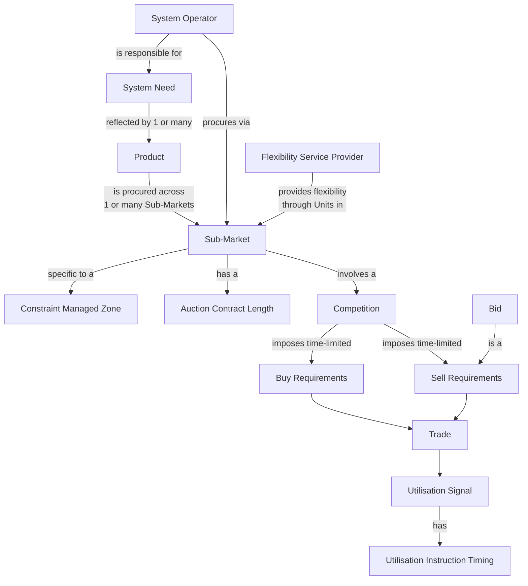

The **Sub-Market** is the unit of organisation in the Flexibility Market. The Market Facilitator Glossary (FMR-GLO) defines it as:

> _A specific segment of the overall Flexibility Market, distinguished by a specific System Operator, procuring a specific product within a specific time period. A Sub-market may be built of multiple distinct geographic zones, operating in different directions, clearing different volumes at different prices._

Three things in this definition matter:

1. **A Sub-Market belongs to one System Operator.** Either NESO or a specific DNO. Cross-operator Sub-Markets aren't a thing.
2. **A Sub-Market procures one Product.** The Product is named in the Sub-Market's identity. This is a deliberate one-Product-per-Sub-Market framing.
3. **A Sub-Market is bounded in time.** The "specific time period" is part of what makes one Sub-Market different from another — typically reflecting the procurement horizon (year-ahead, day-ahead, etc.).

Variation _within_ a Sub-Market is captured by zones, directions, volumes, and prices — not by changing which Product is being procured.

## Sub-Markets, Products, and System Needs

How these concepts connect, in the way the FMRs and the Market Facilitator currently use them:

_Adapted from the Market Facilitator's working concept map of FMR terminology._

The shape that recurs in this map: each Sub-Market is anchored by a System Operator and a Product, situated in a time-bounded Competition that produces Trades, which then drive Utilisation.

## On the assumption that one Product = one Sub-Market

The current published Sub-Market list (see [Sub-Market Catalogue](/reference/sub-market-catalogue)) treats Products and Sub-Markets as essentially 1:1. There are dozens of Sub-Markets because there are many combinations of (System Operator × Product × time period), and historically each combination has been treated as its own Sub-Market.

This is a working assumption, not a structural one. The Market Facilitator's stated direction is to rationalise and align Sub-Markets where appropriate — which may mean fewer, more standardised Sub-Markets in future, even where multiple Products are in play. The 1:1 mapping you see today is a snapshot.

## Sub-Products

A **Sub-Product** is a directional or symmetric variant of a Product within the same Sub-Market. Examples in current operation:

| Sub-Market | Product | Sub-Products |
| --- | --- | --- |
| Dynamic Containment (NESO) | Dynamic Containment | High, Low |
| Dynamic Moderation (NESO) | Dynamic Moderation | High, Low |
| Dynamic Regulation (NESO) | Dynamic Regulation | High, Low |
| Quick Reserve (NESO) | Quick Reserve | Positive, Negative |
| Slow Reserve (NESO) | Slow Reserve | Positive, Negative |
| Balancing Reserve (NESO) | Balancing Reserve | Positive, Negative |

The Sub-Product concept exists because directional symmetry (turn-up vs. turn-down) is a frequent configuration: the same Product, the same Sub-Market, but procured in two directions concurrently. Treating each direction as a separate Sub-Market would be heavy-handed; treating them as one Product blurs an important distinction.

Sub-Product is not currently defined in FMR-GLO. It's used operationally and reflected in the Sub-Markets in scope spreadsheet maintained by the Market Facilitator.

## The Sub-Market and what it parameterises

A Sub-Market is defined by a small set of parameters. The Flexibility Market Catalogue (FMC) framework identifies these:

| Parameter | Examples |
| --- | --- |
| **System Operator** | NESO; or a specific DNO (NGED, NPg, SPEN, SPENW, SSEN, UKPN) |
| **Product** | Operational Utilisation, Peak Reduction, Scheduled Availability \+ Operational Utilisation, Scheduled Utilisation, Variable Availability \+ Operational Utilisation; or NESO ancillary service products |
| **Time period / Auction Contract Length** | STOR Window; 30 minutes; 4 hours; ≤ a Day; Day \< x ≤ Week; Week \< x ≤ Month; Month \< x ≤ Year; Greater Than a Year; Unspecified |
| **License Area / geographic scope** | All SO-associated areas; specific licence areas (NPgN, NPgY, SP Distribution, SP Manweb, SP ENW, SSEH, SSES, LPN, SPN, EPN, WMID, EMID, SWALES, SWEST) |
| **Sub-Products** | Where applicable: High/Low, Positive/Negative |

A Sub-Market submission to the FMC also identifies which of the standard Market Activities apply to that Sub-Market (see [Activity Dependencies](/lifecycle/activity-dependencies)), and the specific time constraints and dependencies between them.

## How Sub-Markets are governed

Sub-Market governance is layered:

- **Legal foundation.** FMR-GLO defines what a Sub-Market is. The Pre-Qualification Criteria FMR (FMR-PQC) defines what's required to participate. The End-to-End Process FMR defines the standard activities. The Product Definitions FMR defines the Products that Sub-Markets procure.
- **Implementation Monitoring.** The Market Facilitator maintains the Flexibility Market Catalogue, into which System Operators submit their Sub-Markets and against which compliance is monitored.
- **Operational rules.** Each System Operator maintains its own Service Terms or operational rules layered on top of the FMRs.

Where these layers conflict, the Flexibility Market Rules win — the Market Facilitator Glossary terms are legally binding via licence conditions.

## Related pages

- [Sub-Market Catalogue](/reference/sub-market-catalogue) — the full current list of Sub-Markets.
- [Needs and Products](/mechanics/needs-and-products) — the upstream concepts.
- [Competition and Clearing](/mechanics/competition-and-clearing) — how Sub-Markets actually clear.
- [Activity Dependencies](/lifecycle/activity-dependencies) — the standard activities a Sub-Market uses.