This is the master conceptual map of the GB flexibility market. It exists to **promote shared meaning across the programme**: when a colleague refers to a "Unit" or a "Buy Requirement" or "Q.9 Pre-Qualify Grid", everyone should be able to come here and find the same answer about what that thing is and how it relates to everything else.

The page is structured as:

1. **Actors and Roles** — the foundational distinction. Establishes who the independent entities are and what responsibilities they assume in different contexts.
2. **The orientation map** — the entire flex world on one canvas, at a single level of detail.
3. **Phase-by-phase zooms** — each Market Phase, with the concepts active in that phase and how they interconnect. FMAR-domain concepts are integrated where relevant.
4. **Cross-cutting concepts** — concepts that span phases.
5. **Adjacent ecosystems** — DSI and CCS, the two adjacent domains FMAR sits within.
6. **A concept index** — every concept on this page, alphabetical, with one-line definitions and links into the full glossary.

Concepts are styled consistently across all diagrams — same visual treatment means same kind of thing — so you can carry meaning between diagrams without having to re-orient.

## Visual conventions

| Style | Meaning |
| --- | --- |
| **Blue rounded, solid** | **Actor** — independent entity with persistent identity (NESO, Elexon, UKPN, Piclo, EDF Energy, Companies House). |
| **Blue rounded, dashed** | **Role** — a contextual, time-bound, process-specific responsibility that an Actor assumes (PSO, FSP, Market Operator). |
| **Amber square** | Asset-side concept (Resource, Asset, Unit). Tagged `[FMAR]` if it derives from the FMAR data model. |
| **Green square** | Market-side concept (Product, Sub-Market, Trade). |
| **Purple square** | Process / activity / phase. |
| **Grey square** | Reference data or supporting concept. |
| **Pink square** | Cross-cutting concept (Identity Resolution, Authority and Consent, Standards). |
| **Solid arrow** | Direct relationship (one concept references or contains another). |
| **Dashed arrow** | Indirect or governance relationship. |

A note on the `[FMAR]` tag: where a concept on the diagrams carries the `[FMAR]` suffix in its label, it derives from the FMAR data model (per the FMAR concepts data dictionary). These are the concepts FMAR will be authoritative for; the unsuffixed concepts are either FMR-defined (legally binding via licence conditions) or operationally-used industry vocabulary.

---

## 1. Actors and Roles

A foundational distinction worth getting right early, because much confusion in the flex world comes from conflating these.

> **Actor.** An actor is a participant _entity_ external to FMAR that exists independently of the process. Examples: NESO, EDF Energy, UK Power Networks, Companies House. Actors have identity and can play (act) in many Roles at once.
>
> **Role.** A role is a _responsibility assumed_ by an actor within a specific process or context. A role is contextual, time-bound, process-specific, assignable, and revocable. An actor can hold multiple roles simultaneously, across assets and sub-markets.

In practice, this means a single Actor like **UK Power Networks** can simultaneously be the Procuring System Operator for one Asset, the Connecting System Operator for another, and a Market Operator (because UKPN runs its own Market Gateway). Three roles, one actor — and FMAR has to know which role is acting at any moment.

### Actors and the Roles they hold

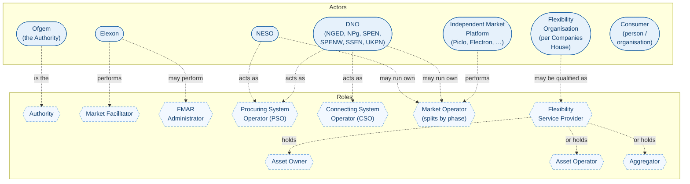

### The Market Operator role splits by phase

The Market Operator role isn't a single role — it's a **family of phase-specific roles**. The systems landscape (per the Market Facilitator's working view) recognises five distinct Market Operator sub-roles, one per operational phase:

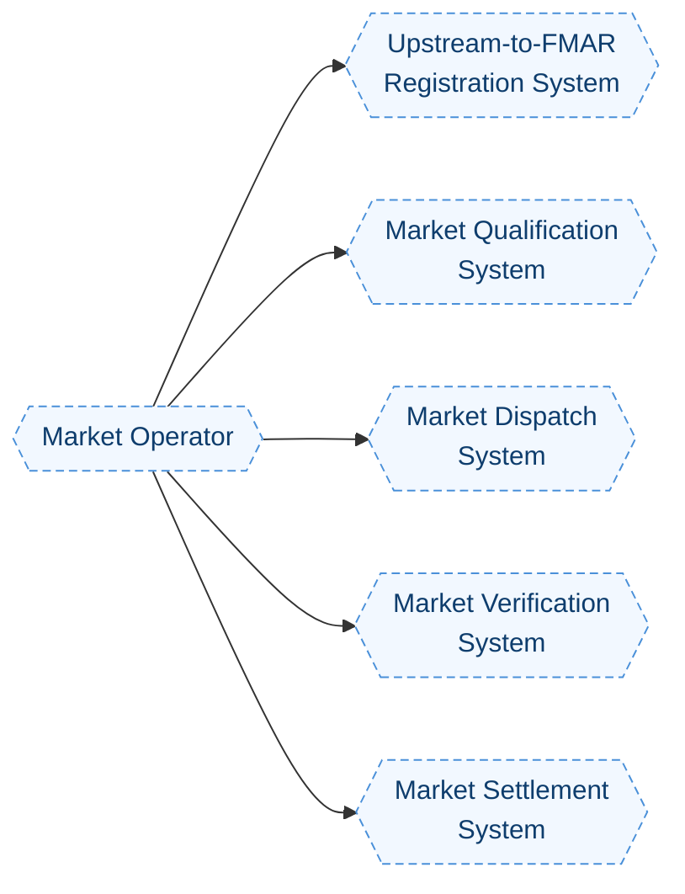

A given Actor may hold several of these phase-roles concurrently (e.g. when a DNO runs a single platform end-to-end internally) or only one (e.g. when an IMP only runs the Qualification system). The roles are individually assignable and revocable, which is what makes "outsource Qualification but keep Dispatch internal" a coherent design choice.

### Why this matters

Three operational consequences flow from this distinction:

- **The same Actor can be in multiple Roles concurrently.** UKPN is both PSO (when it procures) and CSO (when it validates the network connection point) and may also operate Market Operator sub-roles.
- **Roles are revocable; Actors are not.** An FSP can lose its FSP Qualification (the role goes away) without ceasing to be a Flexibility Organisation Actor. This matters for FMAR, which must distinguish active from inactive role-holdings.
- **Permissions sit on Roles, not on Actors.** When CSO needs to be notified of a change to an Accounting Point, the system asks "which Actor holds the CSO role for this connection?" — not "is this Actor a DNO?".

---

## 2. Orientation map

The flex world on one canvas. Read left to right: roles at the edges, the phase spine across the middle, the asset and market sides above and below.

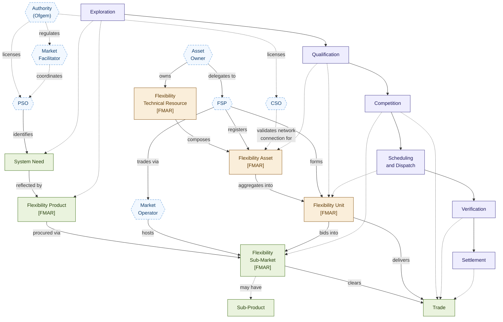

Things to notice:

- **Everything at the edges is a Role.** Actors aren't on this map — Roles are. The same Actor may hold several Roles concurrently (see the Actors and Roles section above).
- **The spine.** The six Market Phases run across the middle. Every other concept is anchored to one or more phases.
- **The bridges.** Two arrows from Unit cross from the asset side to the market side: _bids into_ and _delivers_. These are the architectural joints between FMAR's natural domain (Asset/Unit registration) and the market mechanics (Sub-Market, Trade, Dispatch).
- **PSO and CSO act differently.** PSO is the procuring side; CSO is the validating-grid-connection side. The same DNO Actor often holds both for the same Asset, but the two roles do different work.

---

## 3. Phase-by-phase zooms

Each phase below shows the concepts that are _active_ in that phase — what gets created, transformed, or consumed during it. FMAR-domain concepts (tagged `[FMAR]`) are integrated where the FMAR data model has substance.

### Exploration

The phase before any market participation. The Procuring System Operator and Market Facilitator design what will be procured and how.

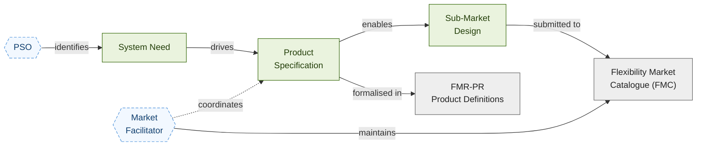

**Key concepts active in this phase.** System Need, Product Specification, Sub-Market Design, the [Flexibility Market Catalogue (FMC)](/reference/glossary), the Product Definitions FMR.

**Activities active in this phase (from the E2E catalogue).** E.1 Define Sub-Market, E.2 Understand Flexibility Markets, E.3 Build Investment Case, E.4 Develop Operational Strategy.

**Notable.** The PSO role does the substantive work here. CSO doesn't appear because Exploration sets up procurement, not connection-level operations.

---

### Qualification

The phase by which FSPs, Assets, and Units become eligible. The most concept-dense phase in the entire model — and where the FMAR data model has its heaviest footprint, since registration and qualification are FMAR's central operational concern.

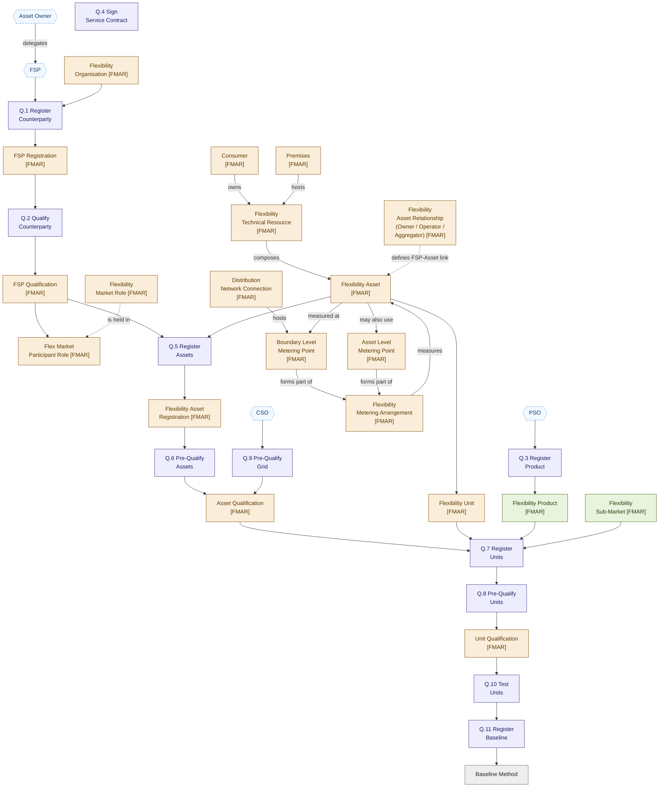

**Key concepts active in this phase.**

- **FMAR organisation/registration:** Flexibility Organisation, FSP Registration, FSP Qualification, Flexibility Market Role, Flexibility Market Participant Role.
- **FMAR asset/connection:** Consumer, Premises, Distribution Network Connection, Boundary Level Metering Point, Asset Level Metering Point, Flexibility Metering Arrangement, Flexibility Technical Resource, Flexibility Asset, Flexibility Unit, Flexibility Asset Relationship.
- **FMAR registration records:** Flexibility Asset Registration, Asset Qualification, Unit Qualification.
- **Market-side touchpoints:** Flexibility Product, Flexibility Sub-Market.
- **Reference:** Baseline Method.

**Activities active in this phase.** Q.1–Q.11. (Q.12 Sign Service Contract has historically been split out; the FMAR-aligned activity catalogue collapses commercial agreement into Q.4.)

**Notable points.**

- **The FSP qualification path and the Asset path run in parallel for a while, and converge.** An FSP first becomes a Qualified FSP (Q.1, Q.2). Independently the Asset is registered and pre-qualified (Q.5, Q.6, with Q.9 grid validation). They converge at Q.7 Register Units, where the qualified FSP and the pre-qualified Asset come together to form a Unit registered for a specific Product within a specific Sub-Market.
- **The Flexibility Asset Relationship is a first-class concept.** An FSP doesn't just have "the Asset" — they have a typed relationship with it (Owner, Operator, or Aggregator). This matters because authority to act on the Asset depends on the relationship type.
- **Two metering points, one arrangement.** A Flexibility Metering Arrangement can comprise both a Boundary Level Metering Point (at the network connection) and an Asset Level Metering Point (behind the boundary, sub-metering specific Assets). The Arrangement itself is the FMAR concept that ties them together.
- **CSO appears here in its Q.9 role.** The Connecting System Operator validates that the network can support the Asset's intended Product, contributing to Asset Qualification.

---

### Competition

The phase in which Trades happen. The smallest activity set (three activities) but the highest-stakes — this is where commercial commitments are formed.

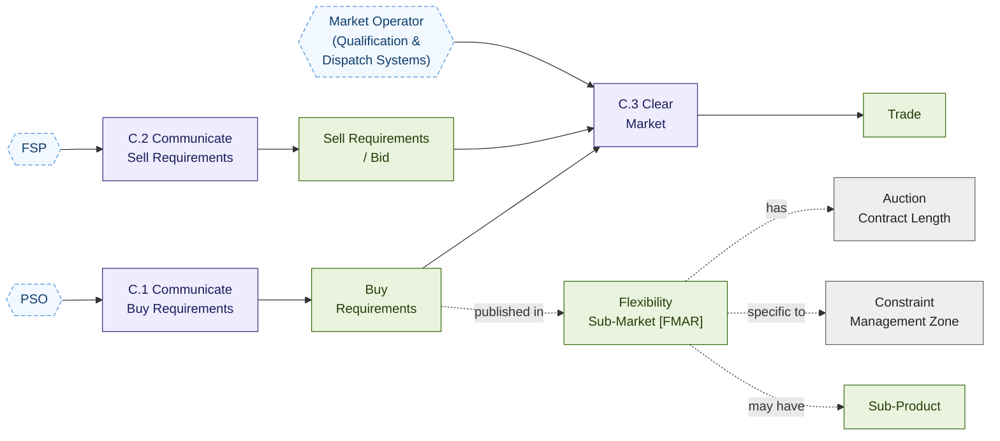

**Key concepts active in this phase.** Sub-Market, Sub-Product, Buy Requirements, Sell Requirements (Bid), Auction Contract Length, Constraint Management Zone (where applicable), Trade.

**Activities active in this phase.** C.1 Communicate Buy Requirements, C.2 Communicate Sell Requirements, C.3 Clear Market.

**Notable points.**

- **Sub-Product appears here, not earlier.** Directional symmetry (High/Low, Positive/Negative, Bids/Offers) shows up in the Buy and Sell Requirements — the Sub-Market itself is one Sub-Market, but its requirements are direction-specific.
- **The Market Operator role here covers the Qualification System (which holds qualified bids data) and the Dispatch System (which clears).** The same Actor may run both, or different Actors may run each.

---

### Scheduling and Dispatch

The phase in which traded flexibility is delivered. Two-level dispatch (Unit then Asset) propagating to physical Resources.

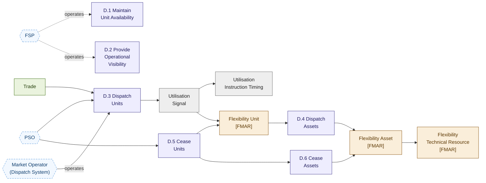

**Key concepts active in this phase.** Trade, Flexibility Unit, Flexibility Asset, Flexibility Technical Resource, Utilisation Signal, Utilisation Instruction Timing.

**Activities active in this phase.** D.1 Maintain Unit Availability, D.2 Provide Operational Visibility, D.3 Dispatch Units, D.4 Dispatch Assets, D.5 Cease Units, D.6 Cease Assets.

**Notable points.**

- **Dispatch is two-level.** D.3 lands on the Unit; D.4 propagates to the Assets within the Unit. Below the Asset, the FSP's energy management system instructs the underlying Flexibility Technical Resources.
- **Cease is two-level too.** D.5 and D.6 mirror D.3 and D.4. D.5 can occur pre-execution (cancel) or in-execution (early stop).
- **The Market Dispatch System operator (a Market Operator sub-role) handles the technical signalling.**

---

### Verification

The phase in which delivery is assessed against contracted commitments.

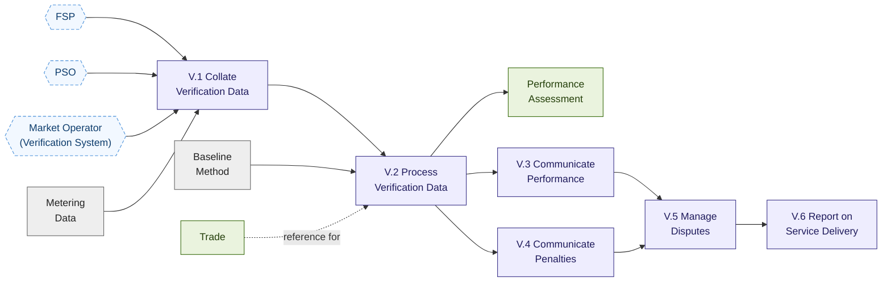

**Key concepts active in this phase.** Metering Data, Baseline Method, Performance Assessment, Trade.

**Activities active in this phase.** V.1–V.6.

**Notable points.**

- **V.3 is direct to FSP.** Performance outcomes go to the relevant Service Provider, not as general disclosure to the wider market. Aggregate market-level reporting sits in V.6.
- **The Market Verification System operator** (another Market Operator sub-role) collates and processes data.

---

### Settlement

The phase in which money flows. Two activities, but their dependencies on prior phases are deep.

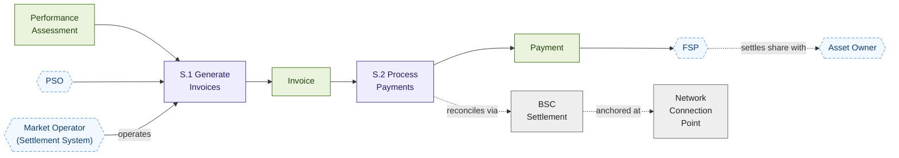

**Key concepts active in this phase.** Performance Assessment, Invoice, Payment, BSC Settlement, Network Connection Point.

**Activities active in this phase.** S.1 Generate Invoices, S.2 Process Payments.

**Notable points.**

- **The connection point is the settlement anchor.** Although Assets are logical entities, settlement still anchors to the network connection point identified by MPAN/MSID, inherited from BSC settlement.
- **The FSP–Asset Owner settlement is private.** It happens in commercial space outside the FMR-defined activities.

---

## 4. Cross-cutting concepts

Some concepts don't sit cleanly in one phase — they span the lifecycle and connect things across it.

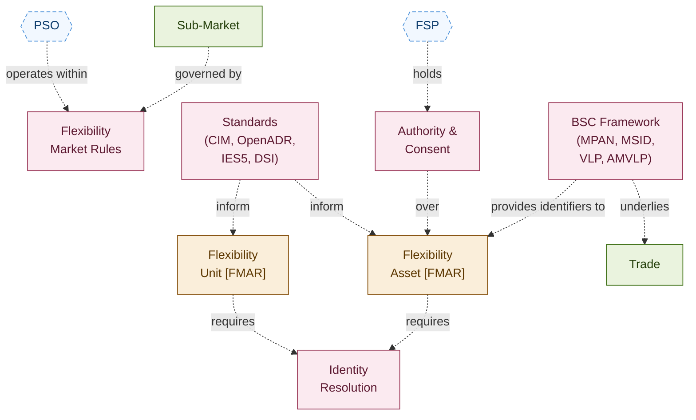

**Identity Resolution.** How the same Asset, Unit, or FSP is recognised across multiple Sub-Markets and across multiple System Operators. This is one of FMAR's central concerns.

**Authority and Consent.** The contractual stack that establishes who has the right to register, update, or operate any given Asset. Spans the Consumer → Asset Owner → Agent → FSP → Procuring System Operator chain. Note the Consumer Consent Indicator on the Consumer entity in the FMAR data model — consent is an explicit registered attribute.

**Standards.** CIM, OpenADR, IES5, and DSI inform how Assets and Units are described and addressed. See [Standards](/reference/standards).

**Flexibility Market Rules.** The governing framework — FMR-GLO, FMR-PD, FMR-PQC, FMR-E2E, FMR-RSR, FMR-SBM, FMR-SMD, FMR-VSM, FMR-CRM, and the Governance Documents.

**BSC Framework.** The wholesale Balancing and Settlement Code framework provides foundational identifiers (MPAN, MSID, AMSID for Asset Metering) and actor types (VLP, VTP, AMVLP) that the flexibility market currently inherits.

---

## 5. Adjacent ecosystems

FMAR doesn't sit in isolation. Two adjacent ecosystems are particularly relevant to FMAR's design and operation: the **Data Sharing Infrastructure (DSI)** and the **Consent and Credential Service (CCS)**. Both operate at industry level and FMAR will integrate with both. The shapes of these ecosystems matter because they constrain how FMAR can be designed.

### Data Sharing Infrastructure (DSI)

DSI is the GB-wide ecosystem for sharing energy system data between authorised parties. It is structured as four layers, each with characteristic Actors and Roles.

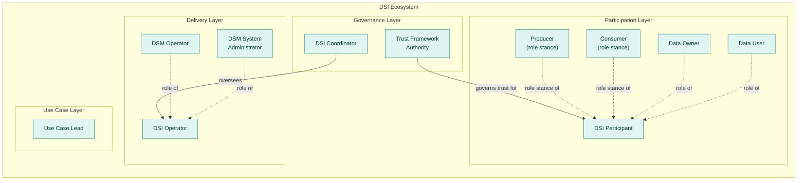

**Why DSI matters to FMAR.** The FMAR Domain sits _within_ the DSI ecosystem — that is, FMAR is one DSI participant alongside others, sharing flexibility data through DSI infrastructure under DSI governance. Some implications:

- FMAR's data sharing protocols must conform to DSI Trust Framework requirements.
- FMAR participants will hold DSI Roles (Producer, Consumer, Data Owner, Data User) when interacting via DSI.
- The DSI Coordinator role is held at industry level and oversees DSI Operators that FMAR will rely on.

### Consent and Credential Service (CCS)

CCS is the industry service that handles consumer consent and the credentials needed to access consumer data. It is structured in six layers.

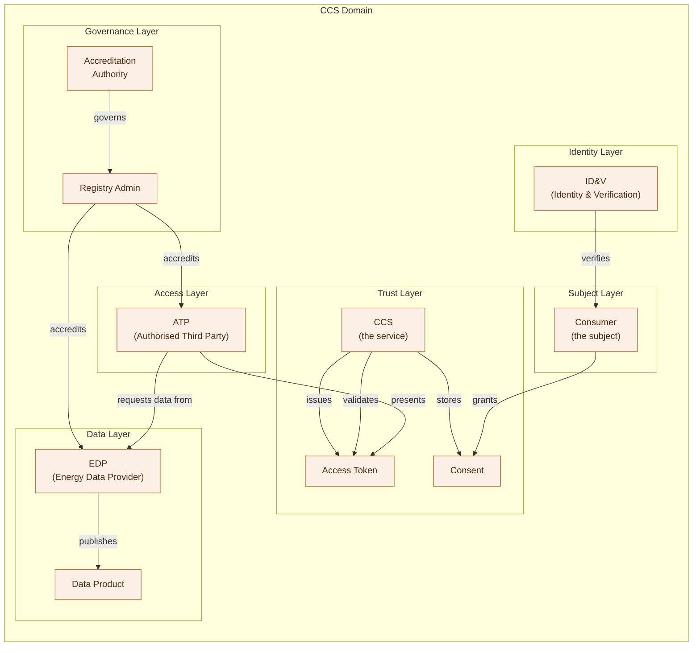

**Why CCS matters to FMAR.** Consumer consent is a first-class concept in the FMAR data model — the Consumer entity carries a Consumer Consent Indicator. The CCS provides the industry-grade infrastructure for managing those consents.

- An FSP acting on a Consumer's flexibility must hold valid Consent for the Consumer's Resources behind their Premises.
- The CCS issues Access Tokens that Authorised Third Parties (ATPs, of which an FSP can be one) present to Energy Data Providers (EDPs) to retrieve data about a Consumer's energy use.
- ID&V (Identity and Verification) underpins the trust chain.

### How FMAR sits between them

The two ecosystems are largely complementary rather than overlapping:

- **DSI** is broad — it's the data-sharing fabric of the energy system as a whole.
- **CCS** is focused — it handles consumer consent and credentialing specifically.
- **FMAR** is the system of record for flexibility market asset and party data, and integrates with both: data flows to/from FMAR via DSI, and consent for Consumer data is handled via CCS.

A simple view of the connections:

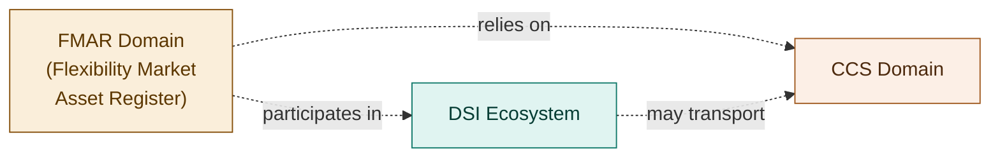

This is a deliberate simplification — the actual integration patterns are more nuanced. But the headline shape is right: FMAR is a participant in DSI, and consumes services from CCS.

---

## 6. Concept index

Every concept appearing on this page, in alphabetical order, with one-line orientation.

| Concept | One-line | Source |
| --- | --- | --- |
| **Accreditation Authority (CCS)** | Governs and accredits CCS participants. | CCS |
| **Aggregator** | A type of Flexibility Asset Relationship — an FSP that aggregates third-party Assets. | FMAR |
| **Asset Level Metering Point** | Sub-metering behind the Boundary Level Metering Point that measures specific Flexibility Assets. | FMAR |
| **Asset Operator** | A type of Flexibility Asset Relationship — an FSP that operates an Asset on behalf of its Owner. | FMAR |
| **Asset Owner** | The Role of legally owning a Resource / Asset. | Industry |
| **Asset Qualification** | The FMAR record approving an Asset Registration for use in a Sub-Market. | FMAR |
| **Authority** | Ofgem (Gas and Electricity Markets Authority). | FMR-GLO |
| **Authorised Third Party (ATP, CCS)** | A party authorised by CCS to request consumer data from an EDP. | CCS |
| **Auction Contract Length** | The duration parameter of a Sub-Market — governs how long resulting Trades last. | Industry |
| **Baseline Method** | The agreed counterfactual for measuring delivered flexibility. | Industry |
| **Boundary Level Metering Point** | The point at which a supply to or from a Distribution Network and a Premises is measured. | FMAR |
| **BSC Framework** | The Balancing and Settlement Code framework providing identifiers and wholesale-side actor types. | BSC |
| **Buy Requirements** | The PSO's published need within a Competition. | Industry |
| **Connecting System Operator (CSO)** | The Role of being responsible for network operations at the point of common coupling. Held by DNOs in respect of connections on their network. | FMAR |
| **Consent (CCS)** | A consumer consent record stored in CCS, granted by the Consumer. | CCS |
| **Constraint Management Zone (CMZ)** | A geographic area within which flexibility is required to manage a network constraint. | Industry |
| **Consumer (FMAR)** | The person or organisation who owns the Technical Resources controlled to deliver Flexibility Services. | FMAR |
| **Consumer (CCS)** | The subject of a Consent — the data subject whose data is being accessed. | CCS |
| **Distribution Network Connection** | The area within the Distribution Network where a Boundary Level Metering Point is located. | FMAR |
| **DNO (Distribution Network Operator)** | Holder of a Distribution Licence. Excludes IDNOs. An Actor class that typically holds PSO and CSO roles. | FMR-GLO |
| **DSI Coordinator** | The governance Role that oversees the DSI Operator. | DSI |
| **DSI Operator** | The Role responsible for delivery of DSI infrastructure. | DSI |
| **DSI Participant** | The Role of participating in DSI as a data Producer or Consumer. | DSI |
| **DSI Trust Framework Authority** | The DSI governance Role that governs trust between participants. | DSI |
| **Energy Data Provider (EDP, CCS)** | A party that publishes Data Products and serves data to ATPs after CCS token validation. | CCS |
| **Exploration** | The Market Phase where needs are identified and Sub-Markets/Products are designed. | FMR-E2E |
| **Flexibility Asset** | One or many Technical Resources controlled and dispatched by an FSP as a single entity, measured by a single Flexibility Metering Arrangement. | FMAR |
| **Flexibility Asset Registration** | The FMAR record, created by an FSP, requesting an Asset's qualification for utilisation within a Flexibility Market. | FMAR |
| **Flexibility Asset Relationship** | The type of association an FSP has to an Asset — Owner, Operator, or Aggregator. | FMAR |
| **Flexibility Market Catalogue (FMC)** | The catalogue of relevant parameters submitted by SOs and maintained by the MF. | FMR-GLO |
| **Flexibility Market Participant Role** | A Flexibility Organisation performing a specific Flexibility Market Role. | FMAR |
| **Flexibility Market Role** | A defined role which can be performed within the Flexibility Market. | FMAR |
| **Flexibility Market Rules (FMRs)** | The set of rules governing the flexibility market, owned by the Market Facilitator. | FMR-GLO |
| **Flexibility Metering Arrangement** | The means by which a specific Flexibility Asset is measured (BLMP and/or ALMP). | FMAR |
| **Flexibility Organisation** | A registered company operating within the Flexibility Market. The Actor class behind FSPs and other roles. | FMAR |
| **Flexibility Product** | The payment structure, energy availability and energy utilisation parameters defined in FMR-PD and NESO Service Term parameters. | FMR-GLO |
| **Flexibility Sub-Market** | Specific segment of the Flexibility Market: one System Operator, one Product, specific time period. | FMR-GLO |
| **Flexibility Technical Resource** | The physical Plant/Apparatus or device (ESA/CEM) that generates, consumes, or stores electricity. | FMAR |
| **Flexibility Unit** | A generalisation of NESO Auction Unit and DNO Asset Group; what gets bid into a Sub-Market. | FMR-GLO |
| **FSP (Flexibility Service Provider)** | The Role of providing Flexibility Services and contracting with an SO. | FMR-GLO |
| **FSP Qualification** | The FMAR record authorising an FSP to enter Flexibility Markets which the SO is responsible for. | FMAR |
| **FSP Registration** | The FMAR record of an FSP's request to become qualified to operate within Flexibility Markets. | FMAR |
| **ID&V (CCS)** | The CCS Identity and Verification service. | CCS |
| **Independent Market Platform (IMP)** | An Actor class — a non-licensed company operating market infrastructure on behalf of one or more PSOs. Typically holds the Market Operator role. | Industry |
| **Invoice** | The financial output of S.1, reflecting verified delivery. | FMR-E2E |
| **Market Activity** | A discrete operational step contributing to a market process. Can occur in parallel or sequentially. | FMR-E2E |
| **Market Dispatch System** | A phase-specific Market Operator sub-role — operates the systems that signal dispatch. | Industry |
| **Market Facilitator** | The Role performed by Elexon under the Authority's designation. | FMR-GLO |
| **Market Operator** | The Role of operating market infrastructure. Splits into five phase-specific sub-roles (Upstream Registration, Qualification, Dispatch, Verification, Settlement Systems). | Industry |
| **Market Phase** | A logical grouping of Market Activities sharing a common objective and temporal alignment. | FMR-E2E |
| **Market Qualification System** | A phase-specific Market Operator sub-role — operates the systems that hold qualified bid data and clear the market. | Industry |
| **Market Settlement System** | A phase-specific Market Operator sub-role — operates the systems that generate invoices and process payments. | Industry |
| **Market Verification System** | A phase-specific Market Operator sub-role — operates the systems that collate and process verification data. | Industry |
| **NESO** | National Energy System Operator Limited. An Actor that holds PSO and (for some platforms) Market Operator roles. | FMR-GLO |
| **Network Connection Point** | The settlement anchor (MPAN / MSID), inherited from BSC. | BSC |
| **Ofgem** | The Authority — GB energy regulator. The Actor that holds the Authority role. | Industry |
| **Payment** | The financial transfer to the FSP after S.2. | FMR-E2E |
| **Performance Assessment** | The output of V.2 — calculated delivered flexibility against contracted commitment. | FMR-E2E |
| **Pre-Qualify** | An ex-ante check that a participant, Asset, or Unit meets minimum requirements. | FMR-E2E |
| **Premises** | The place where energy is consumed or generated by a Consumer. | FMAR |
| **Procuring System Operator (PSO)** | The Role of procuring flexibility services. Held by NESO at national level and by DNOs at distribution level. | FMAR |
| **Qualification** | Both a state (eligible to participate) and a Market Phase (the activities leading to that state). | FMR-GLO |
| **Sub-Market** | See Flexibility Sub-Market. | FMR-GLO |
| **Sub-Product** | Directional/symmetric variant of a Product within the same Sub-Market (e.g. High/Low). | Industry |
| **System Need** | The operational requirement that a Product is intended to address. | Industry |
| **System Operator (SO)** | The Role-class encompassing PSO and CSO. Distinguished from the FMR-GLO entity-class definition (NESO and DNOs as entities). | FMR-GLO |
| **Trade** | A matched buy and sell — the contractual outcome of C.3 Clear Market. | Industry |
| **Unit Qualification** | The FMAR record approving a Flexibility Unit for utilisation in a specific Flexibility Product. | FMAR |
| **Upstream-to-FMAR Registration System** | A phase-specific Market Operator sub-role — operates platforms (or platform front-ends) that capture FSP and Asset registrations and forward them to FMAR. | Industry |
| **Utilisation Signal** | The instruction that initiates delivery of utilisation by a Unit. | Industry |
| **Utilisation Instruction Timing** | The timing parameters of the Utilisation Signal. | Industry |
| **Verification** | The Market Phase in which delivery is assessed. | FMR-E2E |

---

## How to use this page

**As a glossary lookup with context.** When you hear a term and want to know what it is _and how it relates to other things_, this page shows both. The Concept Index gives you the term; the diagrams show its neighbours.

**As an onboarding tool.** A new joiner can scan the orientation map in 30 seconds and understand the shape of the world, then read each phase zoom in 2–3 minutes for depth. Total orientation time: ~25 minutes for the whole flex world including adjacent ecosystems.

**As a working reference in design conversations.** When two colleagues are talking past each other ("System Operator" — do you mean the entity or the role?), pointing at this page resolves it in seconds.

**As a change-tracking surface.** When the FMRs evolve, this page is the canonical place to update — and the visual nature makes the change visible at a glance.

## Maintaining this page

Three rules for keeping it living rather than rotting:

1. **Update when terminology changes.** Whenever FMR-GLO, FMR-E2E, or the FMAR data dictionary is revised, this page should be updated within the same change cycle.
2. **Add new concepts in both the appropriate diagram and the Concept Index.** Don't add to one without the other.
3. **Resist sprawl.** If a concept needs more than two sentences in the index, give it a dedicated page elsewhere on the site and link from here. The point of this page is connectivity, not depth.

A named owner — currently the SME on this programme — should review this page on a fixed cadence (suggested: monthly).

## Related pages

- [Glossary](/reference/glossary) — formal definitions for every concept on this page.
- [Reference Models](/reference/reference-models) — including how concepts here map to international references like FIS / EuroFlex.
- [Sub-Market Catalogue](/reference/sub-market-catalogue) — the live list of Sub-Markets in operation.
- [Activity Dependencies](/lifecycle/activity-dependencies) — the full Market Activity catalogue.