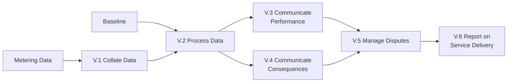

After dispatch, two final phases close the loop: **Verification** establishes whether the delivery met the contracted commitment, and **Settlement** generates and processes the resulting payments.

## Verification

Verification answers the question: how much flexibility was actually delivered, against what was contracted?

The activities (per the End-to-End Process FMR):

- **V.1 Collate Verification Data.** Gather and provide operational metering and/or performance metering data.
- **V.2 Process Verification Data.** Analyse data to calculate performance and assess compliance with obligations.
- **V.3 Communicate Performance.** Report performance outcomes directly to the relevant Service Provider — this is direct, not general disclosure to the wider market.
- **V.4 Communicate Consequences of Non-Delivery.** Report consequences of non-performance such as penalty outcomes to Service Providers.
- **V.5 Manage Disputes.** Resolve disagreements over verification outcomes.
- **V.6 Report on Service Delivery.** Produce regulatory and/or contractual reports for settlement (including aggregate market-level reporting where relevant).

## The role of baselines

A baseline is the counterfactual — what would have happened if the dispatch hadn't been called. Calculated delivery is the difference between actual measured behaviour and the baseline.

The baseline method is registered in **Q.11 Register Baseline Method** during Qualification — the _method_, not the data. Actual baseline data is submitted later, typically in:

- **C.2 Communicate Sell Requirements** — for example, Final Physical Notifications (FPNs) submitted alongside bids for Reserve services.
- **D.1 Maintain Unit Availability** — for products using a baseline-kW dispatch API endpoint.

Baseline methods vary across Products and Sub-Markets:

| Method | How it works |
| --- | --- |
| **Simple historical** | Average of recent comparable periods. |
| **Like-for-like** | Average of similar days excluding dispatch days. |
| **Self-nomination** | The FSP declares the baseline in advance. |
| **Symmetric adjustment** | Historical baseline adjusted by trend factors. |
| **Metered baseline** | Where a separate non-dispatched meter provides reference. |

The baseline method registered for a Unit determines how all subsequent verification is calculated for that Unit's participation in the relevant Product.

## Settlement

Settlement is the financial reconciliation:

- **S.1 Generate Invoices.** Prepare invoices based on verified delivery — volume delivered per Unit per dispatch, contracted price, any penalties or adjustments, any availability payments owed.
- **S.2 Process Payments.** Transfer funds to Service Providers.

Payments typically follow within a contractually agreed window. The FSP then settles its own commercial arrangement with the Asset Owner(s) whose flexibility was used — this is a private commercial relationship not directly visible to the System Operator.

## Provisional vs. final settlement

Most settlement processes have provisional and final stages:

- **Provisional invoice.** Issued shortly after the delivery period.
- **Dispute window.** A defined period during which the FSP can query the assessment.
- **Dispute resolution (V.5).** Queries are worked through; verification data may be re-processed.
- **Final invoice.** Issued after dispute resolution.

This two-stage pattern reflects the practical reality that verification data quality often improves over time, and that some legitimate disputes will arise.

## The connection point and settlement boundary

Although the FMRs frame Assets as logical entities, settlement still happens at the **network connection point** — the same point that wholesale energy settlement uses, identified by MPAN (or MSID in BSC contexts). The flexibility market currently inherits these identifiers from the wholesale settlement framework.

This inheritance has practical implications:

- Where multiple Assets sit behind one connection, settlement disambiguation is the FSP's responsibility.
- Cross-market reconciliation (the same connection participating in multiple products) reconciles at this connection-point level.
- Whether a future GB flex data model introduces an explicit settlement-boundary entity (analogous to the FIS Accounting Point) is an open design question — see [Reference Models](/reference/reference-models).

## Why Verification and Settlement matter disproportionately

These phases are where:

- **Trust is built or eroded.** FSPs that feel verification is unfair will exit the market.
- **Money actually moves.** All upstream activity is potential value; only Settlement realises it.
- **Data quality issues finally surface.** Gaps that didn't matter operationally show up here as disputes.
- **Cross-market reconciliation happens.** Where an Asset participated in multiple Sub-Markets, this is where overlaps are detected.

Many of the structural issues that the Market Facilitator and FMAR are working to resolve — common identity, standardised metering, common settlement boundaries — only matter because of how Verification and Settlement work in practice.

## Related pages

- [Dispatch](/mechanics/dispatch) — the upstream activity that Verification assesses.
- [Assets](/assets/assets) — including the relationship with the network connection point.
- [Reference Models](/reference/reference-models) — including the FIS Accounting Point concept.
- [Lifecycle: Phases](/lifecycle/phases) — the broader sequence.